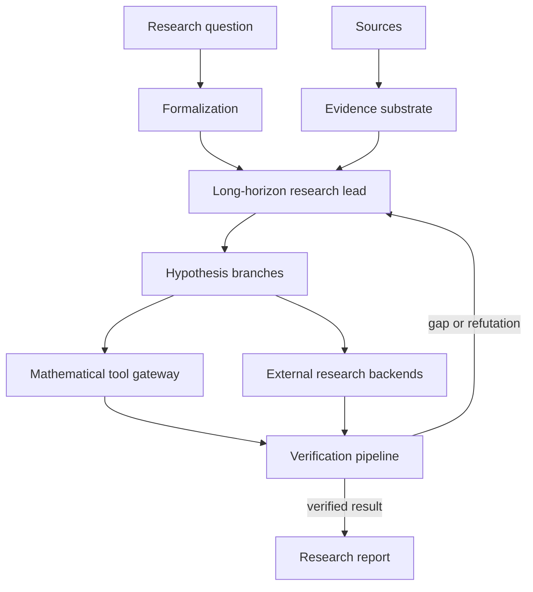

# AdaIvy

<p align="center">
  <a href="https://staple.ai/"></a><br>
  Sponsored and maintained by <a href="https://staple.ai/">Staple AI</a>.
</p>

**A verification-first system for mathematical research.** AdaIvy combines
language models, literature retrieval, symbolic computation, numerical
experiments, and formal tools to investigate mathematical research problems —
and it refuses to let any of them count as a proof on their own.

It is not a chatbot with a large context window. Its central state is a
versioned graph of problems, semantic alignments, claims, representations,
evidence, hypotheses, experiments, and proof obligations. Model output is
treated as a *proposal* until an applicable verifier grants a precisely scoped
warrant. One coherent long-horizon research lead owns that evolving state; a
centralized verifier independently checks candidate progress.

**The core rule:** no model-generated claim becomes trusted merely because
another model agrees with it.

## Why the design is unusual

- **Trust boundaries are machine-checked, not conventions.** Formal validity,
  semantic fidelity, literature novelty, mathematical significance, and
  human/model/tool contribution are recorded as separate, non-interchangeable
  dimensions. None is inferred from another.
- **Determinism is a requirement, not a nicety.** Canonical serialization,
  content hashes, explicit schema versions, frozen timestamps as inputs, and
  offline replay mean an acceptance run reproduces byte for byte. Timing and
  other operational observations are hashed separately so scheduling variance
  cannot change a result's semantic identity.
- **Capability arrives through staged phase gates.** Each capability ships as a
  bounded vertical slice with an architecture decision record, an acceptance
  suite that encodes its thresholds as executable assertions, and explicit
  statements of what it does *not* add. Nothing broader is enabled by default.
- **Fail closed, offline by default.** The runtime is standard-library only,
  network access is off by default, untrusted parsing runs in a digest-pinned
  sandbox with no network or host mounts, and a missing prerequisite produces an
  explicit blocker record rather than a silent pass.
- **Falsification comes first.** Counterexample search starts early, failed
  approaches and dead ends are retained in machine-readable form, and a proof,
  a counterexample, a corrected theorem, or a reduction to an unresolved lemma
  are all successful outcomes.

## Status

- Phases 0 through 4A are implemented and authoritative.
- **Phase 4B** (authorized HTTPS acquisition and exact HTML/TeX/PDF parsing) is
  implementation-complete: its offline acquisition, persistence, deletion,
  replay, and strict digest-pinned OCI parser gate all pass. The separately
  acknowledged live HTTPS gate has been executed and ADR-0050 activates its
  public unauthenticated exact-URL subset. Each invocation still requires a
  human-final content-hashed plan plus an exact execution acknowledgement;
  credentials, caller-supplied headers, crawling, and autonomous origin
  selection remain disabled. A live acquisition yields an untrusted candidate
  carrying no mathematical warrant. Network remains off by default.
- **Phase 5** retains the sealed exact commuting/diagonal slice, verifies
  human-supplied noncommuting certificates, and now discovers certificates for
  the bounded two-outcome, 2×2 `Q(sqrt(d))(i)` domain (ADR-0049). Every generated
  candidate must pass the existing exact verifier. The retained dimension-three
  irreducible-cubic case remains explicitly unresolved; this is not a general
  noncommuting SDP solver, and search tiers 2–4 remain disabled.
- **Phase 3B** supports the sealed single-shot checker, the bounded repair loop,
  and an opt-in Azure OpenAI proposer (ADR-0048). Live repair requires an
  explicit `--execute`, the pinned provider environment and pricing snapshot,
  and the sealed Lean image. Model output changes only the proof fragment,
  remains proposal-only, and never creates epistemic warrant.
- **Phase 6** covers one frozen local held-out case with canonical replay and
  the executed Section 18.4 generality control suite (ADR-0034): thirteen
  controls that drive real Phase 1 trust policy, the exact Phase 5 engine, or the
  held-out capability boundary, each carrying a named single-field falsifiability
  probe that must produce the forbidden verdict. Two controls are positive, so an
  all-reject system cannot pass. The control corpus is project-authored, so the
  suite demonstrates boundary enforcement on known traps and is **not** evidence
  of generality against unseen traps.
- Bounded exploratory synthesis is implemented over the sealed Phase 6
  workspace.
- **Bounded central-lead runtime** (ADR-0047) composes one-round Phase 2 runs
  under a frozen target and content-hashed session bounds. Its history is
  proposer-only, replay makes no model call, and it creates no warrant or
  proof-obligation discharge. It activates no higher search tier and measures
  no retention gain.
- **Phase 4C** covers benchmark-scoped hybrid retrieval only: a frozen
  19-document, 17-query fixture set, an FTS5/BM25 lexical signal, a
  content-keyed alias table, and an exclusion-only evidentiary self-disclaimer
  signal, fused in score space. All seven gates are measured as passing under
  ADR-0032. Exclusion removes a candidate from a result list and asserts
  nothing about applicability.
- Deferred: general noncommuting SDP beyond ADR-0049's exact bounded domain,
  retrieval embeddings and vector indexes, credentialed or autonomous
  acquisition, crawling, broader media, higher adaptive-search tiers, and
  external evaluation.
  Novelty and significance are recorded as `not_assessed`.
- Retrieval uses no embedding and no model provider, so the live provider
  boundary can change without affecting it. Before embeddings are added, note
  the mixed-vector-space constraint in
  [`docs/TECHNICAL_DETAILS.md`](docs/TECHNICAL_DETAILS.md#multiple-model-providers-embeddings-and-retrieval)
  and `TECHNICAL_BLUEPRINT.md` Section 12.2.1: vectors from different providers
  or embedding models may never share a similarity space, and mixing them
  degrades retrieval silently rather than failing.

ADR-0026 records the accepted delivery order for the remaining work; ADR-0012
records the accepted revision 0.3 delivery sequence while preserving the
superseded roadmap history.

## Quick start

Requirements: **CPython 3.14** (the package declares `requires-python >=3.14`,
and the suite has been executed against 3.14.4). No third-party packages, no
network, no model provider, and no container runtime are needed.

```bash
git clone https://github.com/jketts/AdaIvy.git
cd AdaIvy
make check
```

`make check` is the single documented offline entrypoint. It runs the unit,
integration, property, and adversarial suite plus the Phase 0 harness check and
the Phase 1, 2, 3A, 4A, 4B, 5, 6, and synthesis acceptance paths, each against a
disposable temporary workspace.

```bash
make help   # list every target
```

Targets that need more than a bare interpreter are separate and named for what
they need:

| Target | Requires |
|---|---|
| `make check` | nothing beyond CPython 3.14 |
| `make check-sealed` | the ADR-0016 v5 container image (Phase 3B Lean checking) |
| `make check-gate PY=…` | a disposable pinned Draft 2020-12 validator environment |
| `make check-phase4b-oci` | Docker plus the exact pinned Phase 4B parser image |
| `make check-all` | `check` + `check-sealed` |

`make check-sealed`, `make check-gate`, and `make check-phase4b-oci` are
local/owner-run because their prerequisites are not publicly available.
Continuous integration runs the offline check only.

## Running the tests

The test suite is plain `unittest` — there is no pytest configuration, and the
runtime deliberately has no third-party dependencies. `make check` exports
`PYTHONPATH=src` and `PYTHONDONTWRITEBYTECODE=1` itself, so the ordinary way to
run the tests is just `make check`. To invoke them directly:

```bash
PYTHONDONTWRITEBYTECODE=1 PYTHONPATH=src python3 -m unittest discover -s tests
```

Some skips are expected: fifteen Phase 4 gate tests skip themselves unless the
disposable JSON Schema validator environment is importable. CI asserts the
expected skip count so a test cannot quietly stop running.

## Using the CLI

Every phase is reachable from one entrypoint:

```bash
PYTHONPATH=src python3 -m math_research.cli --help
```

Installing the package also provides the `adaivy` and `adaivy-phase0` console
scripts. Per-phase commands, their exact arguments, and what each slice does and
does not do are documented in
[docs/TECHNICAL_DETAILS.md](docs/TECHNICAL_DETAILS.md).

## Repository layout

```text
src/math_research/     phase slices (phase2 … phase6, synthesis), shared domain
                       and application code, interchange, reporting, and cli.py
src/phase0_harness/    Phase 0 adoption/evaluation harness
tests/                 flat unittest modules, one per slice or contract
fixtures/              deterministic per-phase acceptance fixtures
schemas/               versioned JSON schemas for every interchange boundary
migrations/            per-phase SQL migrations
config/                pinned run configurations, pricing snapshots, image digests
spikes/                reproducible component-evaluation spikes
reports/               measured per-phase results and gate evidence
benchmarks/            the quantum-discrimination benchmark package
prompts/               versioned prompt templates
docs/                  architecture decision records and per-phase documentation
```

The blueprint's intended target layout (ports/adapters/workers packages, tiered
test directories) differs from the current tree and is preserved in
[docs/TECHNICAL_DETAILS.md](docs/TECHNICAL_DETAILS.md#intended-repository-layout).

## Documentation

| Document | Purpose |
|---|---|
| [docs/TECHNICAL_DETAILS.md](docs/TECHNICAL_DETAILS.md) | Per-phase implementation detail, commands, and boundaries |
| [TECHNICAL_BLUEPRINT.md](./TECHNICAL_BLUEPRINT.md) | The build contract, domain model, and phase exit criteria |
| [NOVELTY_LANDSCAPE.md](./NOVELTY_LANDSCAPE.md) | Prior-art review that informed architecture revision 0.2 |
| [AGENTS.md](./AGENTS.md) | Repository instructions, current phase, and engineering rules |
| [docs/adrs/](docs/adrs/) | Architecture decision records |
| [docs/phase-0/](docs/phase-0/) … [docs/phase-4c/](docs/phase-4c/) | Per-phase gate reports, threat models, and test matrices |

## The problem this addresses

Ordinary chat-based research has predictable failure modes:

- assumptions disappear as a discussion grows;
- a plausible derivation is mistaken for a proof;
- citations are detached from the exact claims they support;
- real citations are used under incompatible hypotheses or definitions;
- computational evidence is reported as a universal result;
- equivalent-looking reformulations are used without proving equivalence;
- a proof assistant verifies a statement that does not mean what the researcher
  intended;
- failed approaches are forgotten and repeated;
- generated summaries contaminate the trusted source corpus.

This project makes those boundaries explicit and machine-checkable. A claim is
promoted only through explicit evidence and an applicable verifier. Retrieval
supports reasoning; it does not establish truth. Experiments can refute
universal claims and support conjectures; they do not replace proof.

## How it fits together



The full twelve-step research lifecycle, the complete list of architectural
principles, and the definition of done for the first vertical slice are in
[docs/TECHNICAL_DETAILS.md](docs/TECHNICAL_DETAILS.md).

## First benchmark

The first end-to-end benchmark studies the iterative method in Jezek, Rehacek,
and Fiurasek, “Finding optimal strategies for minimum-error quantum-state
discrimination” ([arXiv:quant-ph/0201109](https://arxiv.org/abs/quant-ph/0201109)),
asking whether the iteration always reaches a global optimum under precisely
stated assumptions. Quantum-specific mathematics stays inside the benchmark
package and must not leak into the core claim, evidence, workflow, or
verification abstractions.

## Licence

Licensed under the Apache License, Version 2.0 — see [LICENSE](./LICENSE). This
grants use, modification, and redistribution, including an express patent grant,
provided you preserve the copyright and attribution notices and state any
changes you make.

Fixture corpora under `fixtures/` are project-authored synthetic data carrying
the separate identifier `LicenseRef-AdaIvy-Synthetic-Fixture`; they are not
third-party content.

## Contributing

There is no `CONTRIBUTING.md` yet. Before proposing a change, read
[AGENTS.md](./AGENTS.md) for the engineering rules and change-control
expectations, and the relevant records in [docs/adrs/](docs/adrs/). In short:
architecture changes are recorded in an ADR rather than made silently, each
slice ships an acceptance suite that encodes its thresholds as executable
assertions, and `make check` must stay green.
