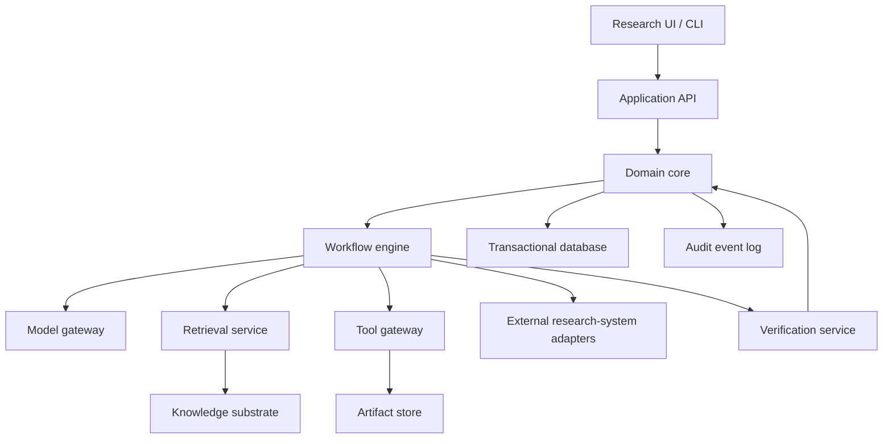
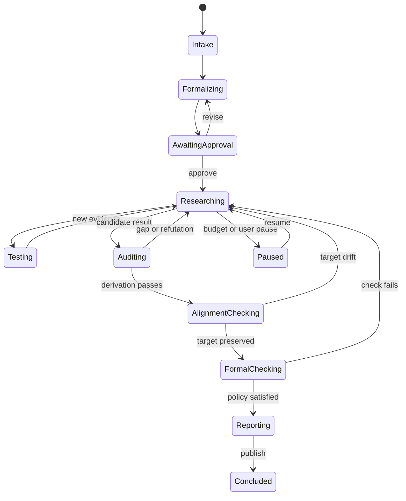

# Technical Blueprint: Verification-First Mathematical Research System

**Document status:** Architecture baseline 0.7 — bounded Phase 4B acquisition
and exact-source parsing, local Phase 5 and Phase 6 slices, and the ADR-0027
exploratory-synthesis slice are accepted and implemented on 20 August 2026.
The exact OCI parser gate passes; the separately acknowledged live HTTPS gate
is the final Phase 4B activation step. Noncommuting SDP, higher adaptive-search
tiers, hybrid retrieval, broader acquisition/media, and external evaluation
remain deferred. ADR-0029 refines the future adaptive
search architecture without activating those tiers. ADR-0012 preserves the
superseded roadmap history.

**Audience:** Implementers, mathematical researchers, evaluators, and AI-system
operators

**Purpose:** Define a buildable, domain-agnostic platform for computer-assisted
mathematical research using language models without treating model output as
proof.

---

## 1. Executive decision record

The platform will be built around six durable abstractions:

1. a **versioned problem specification** defining the actual research target;
2. a **semantic-custody record** showing that each working or formal statement
   still means what the researcher intended;
3. a **claim graph** describing mathematical dependencies;
4. a **proof-obligation ledger** recording every unresolved logical step;
5. an **evidence graph** recording sources, derivations, computations, and
   verifier results; and
6. a **frozen evaluation protocol** separating exploration from confirmatory
   assessment.

Conversation transcripts, retrieved passages, model responses, and experiment
logs are supporting artifacts. None is the source of mathematical truth.

**Separation of research claims.** AdaIvy treats mathematical plausibility,
formal correctness, statement alignment, and scholarly novelty as separate
claims supported by different evidence. The default execution model remains a
coherent research lead coupled to an incremental formalizer. Formal
verification certifies the encoded theorem but does not by itself certify that
the theorem matches the intended source problem or constitutes a novel
contribution. Statement alignment and scholarly review are applied at
candidate-result boundaries, while exploratory work remains lightweight.

The system must support both proof and disproof. Its valid terminal outcomes are:

- proved result;
- disproved result or certified counterexample;
- theorem under narrower assumptions;
- reduction to explicit unresolved obligations;
- computationally supported conjecture;
- inconclusive result with a reproducible research record.

### 1.1 Primary architectural decisions

| Decision | Choice | Reason |
|---|---|---|
| Core state | Typed relational entities plus an append-only audit log | Enforces invariants and permits replay |
| Research structure | Directed claim/evidence graph | Mathematics is dependency-shaped, not conversational |
| Model role | Proposer and planner | Model agreement is not verification |
| Verification | Pluggable verifier hierarchy | Different domains require different standards |
| Epistemic state | Orthogonal warrants, never one confidence score | Meaning, proof, novelty, and significance are different questions |
| Orchestration | Coherent long-horizon research lead, centralized verifier, and bounded branch search | Long research runs must resume, synthesize across branches, and remain inspectable |
| Search complexity | Rich central loop with selectively activated overlays | Parallel/evolutionary search is retained only for measured cost-adjusted verified gains |
| Retrieval | Hybrid and provenance-preserving | Vector similarity alone loses symbols and assumptions |
| Tool execution | Sandboxed, reproducible jobs | Mathematical evidence must be repeatable |
| Model integration | Provider-neutral gateway | Avoid coupling research state to one API or model |
| Existing systems | Adopt, wrap, or interoperate before rebuilding | The objective is research capability, not architectural novelty |
| Initial delivery | Modular monolith | Preserve boundaries without premature distributed systems |
| First benchmark | Quantum-state discrimination iteration | Exercises proof, SDP, numerics, and counterexamples |

### 1.2 Non-goals for the initial system

- Claiming autonomous resolution of famous open problems
- Treating consensus among model calls as proof
- Crawling the entire mathematical web before a vertical slice works
- Automatically importing model summaries as trusted knowledge
- Replacing proof assistants, numerical certification, or expert review
- Building a general-purpose social chat interface
- Optimizing first for maximum agent count or maximum context length
- Reimplementing an open-source prover, knowledge layer, or research harness
  without first testing whether an adapter satisfies the requirement
- Representing formal validity, semantic fidelity, novelty, and significance as
  one ordinal “verification level”

---

## 2. Correctness contract

The following invariants are mandatory and should be enforced in domain code,
database constraints where possible, and tests.

### C1. Provenance completeness

Every externally sourced claim must point to:

- a content-addressed source document version;
- a precise source span or structured location;
- the extraction method and version; and
- the original text or mathematical object needed to audit the extraction.

### C2. No self-promotion

A model run may create a proposed claim, hypothesis, plan, or proof step. It may
not create a successful verification record for its own output.

### C3. Evidence/verdict separation

Evidence records are immutable observations. Verdicts interpret evidence under
a named verification policy. Changing a verdict creates a new record; it does
not rewrite the evidence.

### C4. Experiments do not prove universal claims

Finite testing may:

- refute a universal claim with a valid counterexample;
- support a conjecture;
- establish a finite, explicitly bounded claim; or
- provide a rigorously certified bound.

It may not promote an unrestricted universal claim to `proved`.

### C5. Representation bridges are obligations

If a proof uses a transformed representation, the system must record the
encoding, decoding or implication map, preserved properties, exceptional cases,
and a bridge claim. The conclusion cannot be stronger than the verified bridge.

### C6. Assumptions are inherited explicitly

Every claim has an assumption context. Derivations must show that parent
assumptions cover child requirements. Silent strengthening or weakening is an
error.

### C7. Reproducibility

Any computational evidence must record enough information to reproduce it:

- code and dependency version;
- input content hashes;
- parameters and random seeds;
- numerical precision and tolerances;
- runtime image/environment identity;
- stdout, stderr, outputs, and exit status.

### C8. Negative results are first-class

Refutations, failed branches, incompatible assumptions, unsuccessful tool runs,
and abandoned proof strategies remain queryable and must not be discarded from
the research history.

### C9. Final-report traceability

Every material mathematical sentence in a final report must reference one or
more claim identifiers. Each referenced claim must expose its assumptions,
evidence, and verification state.

### C10. Idempotent orchestration

Every asynchronous action has an idempotency key. Retrying a job may append a
retry event but must not duplicate the semantic result.

### C11. Semantic target custody

Logical verification applies only to an exact statement. Every candidate result
must identify the approved formalization and a semantic-alignment record. A
proof of a changed, weakened, vacuous, or accidentally reinterpreted statement
does not resolve the original problem.

### C12. Citation applicability

A real source and a matching passage do not establish that a theorem applies.
Every load-bearing imported result must record its exact statement, hypotheses,
definition correspondence, scope, and the checked implication to the local
claim. Bibliographic existence and mathematical applicability are separate
verdicts.

### C13. Verifier context isolation

An independent verifier receives a reconstructed context containing the target,
accepted premises, candidate proof object, and raw evidence. It must not inherit
the proposer’s untrusted persuasive narrative or hidden reasoning trace. The
exact verifier context is recorded in a manifest.

### C14. Evaluation integrity

Confirmatory datasets, metrics, success criteria, and stopping rules are frozen
before confirmatory execution. Search agents cannot use held-out results to
choose what to report. Exploratory and confirmatory runs are labeled and stored
separately; unsuccessful runs remain visible.

### C15. Orthogonal epistemic assessment

The platform separately records:

- fidelity to the intended problem;
- logical or empirical warrant;
- literature novelty;
- mathematical significance; and
- human and machine contributions.

No projection may silently infer one of these properties from another.

### C16. Material partial-result surfacing

Whenever verified work materially refutes, restricts, strengthens,
generalizes, or redirects an active research objective, the system must append
and expose a durable, steerable research event even when the objective remains
incomplete. The event must retain its exact content-addressed result identity,
objective/run/branch identity, independently verified evidence snapshot,
materiality decision, trusted principal capability, policy, causality, and
available steering actions. Later steering and evidence-lifecycle changes are
separate immutable append-only records whose deterministic projection cannot
rewrite or erase the original event. The event cannot be created from an
unverified proposal, silently complete the parent objective, or disappear
through correction, invalidation, acknowledgement, dismissal, replay, or
restart.

### C17. Exploratory synthesis preserves authority and history

C17 is active for the bounded synthesis slice accepted by ADR-0027. The slice keeps
source applicability, extraction fidelity, mathematical warrant, and graph admission
as independent axes; requires finite run bounds; and preserves negative and
abandoned branches. Source correction, revocation, takedown, deletion, changed
rights applicability, or a superseding `ApplicabilityReview` must append
closure/invalidation records through affected derived projections without
erasing audit history. The authoritative proposed contract is
`docs/phase-4/EXPLORATORY_RESEARCH_SYNTHESIS_V1.md`.
---

## 3. System context

### 3.1 Actors

- **Researcher:** owns the problem statement, approves formalization, and decides
  whether a result is ready to publish.
- **Long-horizon research lead:** maintains the coherent problem interpretation,
  branch portfolio, unresolved obligations, and synthesis across bounded actions.
- **Model providers:** propose structured plans, claims, critiques, and drafts.
- **Source providers:** papers, books, repositories, datasets, and metadata APIs.
- **Mathematical tools:** symbolic systems, numerical solvers, graph tools,
  SAT/SMT solvers, and proof assistants.
- **Centralized verifier:** applies deterministic or independently configured
  checks from reconstructed contexts and is never controlled by search workers.
- **Operator:** configures credentials, compute limits, models, and security
  policies.

### 3.2 Container architecture



The initial implementation should be a modular monolith with background
workers. The module boundaries are logical ports so services can be split later
only when workload or security requirements justify it.

### 3.3 Adopt, wrap, interoperate, then build

Before implementing a major subsystem, evaluate in this order:

1. **Adopt:** use an existing component directly if its trust boundary and data
   model satisfy the correctness contract.
2. **Wrap:** place an adapter around a useful but differently shaped component.
3. **Interoperate:** exchange typed artifacts when the external system must own
   its internal state.
4. **Build:** implement locally only when the preceding options fail a recorded
   requirement or impose unacceptable operational risk.

Initial reference spikes should include:

| Capability | Systems or standards to test | What to learn or reuse |
|---|---|---|
| Proof-state workflow | Albilich and MathGraph | Claims, debts/obligations, failures, countermodels, replay |
| Mathematical knowledge representation | OMDoc/MMT | Objects, statements, theories, morphisms, flexiformal content |
| Verification-condition dispatch | Why3 | Stable intermediate obligations and pluggable provers |
| Lean retrieval and proof search | LeanDojo, LeanSearch, and available Lean agents | Premise selection, compiler feedback, proof repair |
| Literature synthesis | PaperQA-style agents | Iterative search, cited synthesis, contradiction retrieval |
| Executable discovery | FunSearch/AlphaEvolve-style loops | Archives, diversity, and evaluator-driven search |
| Typed scientific provenance | Eigenius | Structural warrant types and cross-system translations |

Adoption is conditional on license, maintenance, reproducibility, security, and
benchmark fit. Public claims are not accepted as evidence of fitness; each
candidate must be exercised on the same reference dossier.

---

## 4. Domain model

All persistent entities use opaque IDs, `created_at`, `created_by`, a schema
version, and optimistic concurrency where mutable. Immutable records use content
hashes.

### 4.1 ResearchProblem

Represents the user-owned research objective.

```yaml
ResearchProblem:
  id: ProblemId
  title: string
  informal_statement: markdown
  problem_type: prove | disprove | optimize | classify | compute | explore
  domain_tags: [string]
  status: draft | formalizing | active | paused | concluded | archived
  active_formalization_id: FormalizationId | null
  owner_id: ActorId
  budget_policy_id: BudgetPolicyId
```

### 4.2 Formalization

Formalizations are immutable versions. A new interpretation creates a new
version or a sibling formalization; it never silently edits the old statement.

```yaml
Formalization:
  id: FormalizationId
  problem_id: ProblemId
  version: integer
  statement: markdown
  formal_language: informal_math | latex | lean | coq | isabelle | smtlib | other
  formal_source: string | null
  objects: [MathematicalObjectId]
  quantifiers: [Quantifier]
  assumptions: [ClaimId]
  target_claim_id: ClaimId
  success_criteria: [Criterion]
  admissible_methods: [string]
  excluded_methods: [string]
  ambiguities: [Ambiguity]
  approval_status: proposed | needs_clarification | approved | superseded
```

### 4.3 MathematicalObject

Stores typed objects and their scope.

```yaml
MathematicalObject:
  id: MathematicalObjectId
  formalization_id: FormalizationId
  symbol: string
  object_type: set | number | function | sequence | operator | space | graph | other
  definition_claim_id: ClaimId
  domain: string | null
  codomain: string | null
  constraints: [ClaimId]
```

### 4.4 Claim

A claim is the atomic unit of mathematical reasoning.

```yaml
Claim:
  id: ClaimId
  problem_id: ProblemId
  branch_id: BranchId | null
  kind: definition | assumption | conjecture | lemma | theorem | corollary |
        equivalence | counterexample | computation | bound | citation_claim
  statement: markdown
  normalized_expression: string | null
  quantifiers: [Quantifier]
  assumption_claim_ids: [ClaimId]
  truth_status: unknown | supported | refuted | proved | disproved | inconsistent
  warrant_ids: [WarrantId]
  active_semantic_alignment_id: SemanticAlignmentId | null
  origin: user | source | model | tool | formal_system
  supersedes_claim_id: ClaimId | null
```

Truth status is a policy projection, not a mutable confidence field. Warrants
retain the kind and scope of support. There is deliberately no canonical scalar
verification level: a formally verified statement may still be misaligned with
the intended problem or already known in the literature.

### 4.5 ClaimDependency

```yaml
ClaimDependency:
  parent_claim_id: ClaimId
  child_claim_id: ClaimId
  relation: implies | equivalent_to | requires | contradicts | specializes |
            generalizes | defines | cites | computed_from
  bridge_obligation_id: ObligationId | null
```

Cycles are allowed only for non-deductive relations such as `equivalent_to` or
`cites`. The deductive dependency projection must remain acyclic within a proof
version.

### 4.6 ProofObligation

```yaml
ProofObligation:
  id: ObligationId
  claim_id: ClaimId
  description: markdown
  category: logical_gap | missing_assumption | representation_bridge |
            source_validation | numerical_rigor | domain_condition |
            termination | edge_case | semantic_alignment |
            literature_applicability | premise_smuggling | evaluator_validity
  status: open | assigned | blocked | discharged | failed | waived
  discharge_claim_ids: [ClaimId]
  verifier_run_ids: [VerifierRunId]
  waiver_reason: string | null
```

A waived obligation prevents the containing argument from receiving a `proved`
verdict unless the applicable policy explicitly permits the waiver.

### 4.7 Representation and RepresentationMap

```yaml
Representation:
  id: RepresentationId
  problem_id: ProblemId
  name: string
  formalism: arithmetic | algebraic | geometric | topological | graph |
             dynamical | variational | logical | computational | other
  objects: [MathematicalObjectId]
  defining_claim_ids: [ClaimId]

RepresentationMap:
  id: RepresentationMapId
  source_id: RepresentationId
  target_id: RepresentationId
  encoding_claim_id: ClaimId
  inverse_or_recovery_claim_id: ClaimId | null
  preserved_property_claim_ids: [ClaimId]
  exceptional_case_claim_ids: [ClaimId]
  bridge_obligation_ids: [ObligationId]
  status: proposed | partially_verified | verified | refuted
```

### 4.8 Hypothesis and ResearchBranch

```yaml
ResearchBranch:
  id: BranchId
  problem_id: ProblemId
  parent_branch_id: BranchId | null
  title: string
  strategy: markdown
  status: proposed | active | blocked | refuted | merged | abandoned | completed
  priority: float
  budget: BudgetAllocation

Hypothesis:
  id: HypothesisId
  branch_id: BranchId
  claim_id: ClaimId
  motivation_claim_ids: [ClaimId]
  predicted_claim_ids: [ClaimId]
  falsification_plan: markdown
```

### 4.9 SourceDocument and SourceSpan

```yaml
SourceDocument:
  id: SourceDocumentId
  canonical_uri: string
  title: string
  authors: [string]
  publication_metadata: object
  content_hash: sha256
  media_type: string
  acquired_at: datetime
  license_metadata: object | null
  trust_class: primary | secondary | informal | unknown

SourceSpan:
  id: SourceSpanId
  document_id: SourceDocumentId
  locator: PageSectionEquationLocator
  raw_content: string
  normalized_content: string
  content_hash: sha256
  parser_name: string
  parser_version: string
```

### 4.10 SourceApplicabilityRecord

A source span proves only what it actually states. This record captures whether
an imported theorem can carry weight in the current argument.

```yaml
SourceApplicabilityRecord:
  id: SourceApplicabilityId
  local_claim_id: ClaimId
  source_span_id: SourceSpanId
  imported_statement: markdown
  imported_hypotheses: [markdown]
  definition_correspondences: [RepresentationMapId]
  scope_and_exceptions: [markdown]
  implication_obligation_id: ObligationId
  bibliographic_status: confirmed | disputed | unresolved
  applicability_status: proposed | checked | rejected | unresolved
  reviewer_ids: [ActorId]
```

### 4.11 Evidence

```yaml
Evidence:
  id: EvidenceId
  claim_id: ClaimId
  kind: source_span | derivation | experiment | symbolic_check |
        rigorous_numeric | formal_proof | counterexample | expert_review
  artifact_ids: [ArtifactId]
  source_span_ids: [SourceSpanId]
  produced_by_run_id: RunId | null
  supports: supports | refutes | contextualizes
  immutable_payload_hash: sha256
```

### 4.12 Experiment and ToolRun

```yaml
Experiment:
  id: ExperimentId
  branch_id: BranchId
  tested_claim_ids: [ClaimId]
  method: markdown
  expected_outcomes: [string]
  interpretation_policy: string
  evaluation_protocol_id: EvaluationProtocolId | null
  run_class: exploratory | confirmatory

ToolRun:
  id: ToolRunId
  experiment_id: ExperimentId | null
  tool_adapter: string
  tool_version: string
  environment_digest: string
  input_artifact_ids: [ArtifactId]
  parameters: object
  seed: integer | null
  precision: string | null
  tolerance_policy: string | null
  status: queued | running | succeeded | failed | cancelled | timed_out
  output_artifact_ids: [ArtifactId]
  exit_metadata: object
  idempotency_key: string
```

### 4.13 VerificationRecord

```yaml
VerificationRecord:
  id: VerificationId
  claim_id: ClaimId
  policy_id: VerificationPolicyId
  verifier_type: schema | deterministic | independent_model | symbolic |
                 interval | proof_assistant | human
  verifier_identity: string
  input_hashes: [sha256]
  verdict: pass | fail | inconclusive
  findings: [Finding]
  resulting_warrant_ids: [WarrantId]
  context_manifest_id: VerifierContextManifestId
  created_at: datetime
```

Verification records are append-only. Claim status is a projection derived from
valid records under the current policy.

### 4.14 ModelRun

```yaml
ModelRun:
  id: ModelRunId
  purpose: formalize | plan | retrieve_query | propose | critique | synthesize
  provider: string
  model_identifier: string
  model_snapshot: string | null
  prompt_template_id: string
  prompt_template_version: string
  input_claim_ids: [ClaimId]
  input_evidence_ids: [EvidenceId]
  response_artifact_id: ArtifactId
  structured_result_hash: sha256
  tool_call_ids: [ToolRunId]
  usage: object
  status: succeeded | failed | refused | partial
```

Store concise structured rationales, cited inputs, and proposed operations. The
system does not require hidden chain-of-thought to be stored or exposed.

### 4.15 SemanticAlignmentRecord

Semantic alignment is distinct from proof checking and is versioned whenever a
statement changes.

```yaml
SemanticAlignmentRecord:
  id: SemanticAlignmentId
  problem_id: ProblemId
  informal_statement_hash: sha256
  formalization_id: FormalizationId
  compared_claim_id: ClaimId
  quantifier_mapping: object
  definition_mapping: object
  assumption_delta: [markdown]
  edge_case_delta: [markdown]
  strength_relation: equivalent | weaker | stronger | overlapping | unrelated |
                     unresolved
  status: proposed | researcher_approved | disputed | superseded
  approved_by: ActorId | null
  approval_artifact_id: ArtifactId | null
```

Machine checks and model reviews may propose this record, but only the
researcher or a delegated mathematical reviewer may approve a material target
interpretation.

### 4.16 EpistemicWarrant

```yaml
EpistemicWarrant:
  id: WarrantId
  claim_id: ClaimId
  kind: source_grounded | experimentally_observed | mechanically_derived |
        rigorously_certified | formally_verified | human_attested
  scope: markdown
  evidence_ids: [EvidenceId]
  verification_record_ids: [VerificationId]
  status: active | challenged | superseded | withdrawn
```

Warrant kinds are peers with different semantics, not rungs on a universal
ladder. Policies may require combinations of warrants for particular claim
kinds.

### 4.17 EvaluationProtocol

```yaml
EvaluationProtocol:
  id: EvaluationProtocolId
  problem_id: ProblemId
  version: integer
  phase: exploratory | confirmatory
  datasets_and_splits: [ArtifactId]
  metrics: [MetricDefinition]
  success_criteria: [Criterion]
  stopping_rules: [Criterion]
  allowed_adaptations: [string]
  contamination_controls: [string]
  frozen_at: datetime | null
  frozen_by: ActorId | null
```

Once frozen, confirmatory fields are immutable. Deviations create a new version
and are disclosed in reports.

### 4.18 Novelty, significance, and contribution records

```yaml
NoveltyAssessment:
  id: NoveltyAssessmentId
  claim_id: ClaimId
  search_protocol_id: EvaluationProtocolId
  terminology_variants: [string]
  compared_source_ids: [SourceDocumentId]
  status: not_assessed | search_incomplete | apparently_known |
          apparently_novel | expert_reviewed
  limitations: [string]

SignificanceAssessment:
  id: SignificanceAssessmentId
  claim_id: ClaimId
  assessor_id: ActorId
  rubric_id: string
  category: not_assessed | technical | useful | publishable | major | landmark
  rationale_artifact_id: ArtifactId

ResearchContributionRecord:
  id: ContributionId
  artifact_or_claim_id: opaque_id
  actor_id: ActorId
  actor_type: human | model | tool | external_system
  contribution_type: formulation | retrieval | conjecture | proof_strategy |
                     derivation | computation | verification | exposition
  provenance_ids: [opaque_id]
```

### 4.19 VerifierContextManifest

```yaml
VerifierContextManifest:
  id: VerifierContextManifestId
  verifier_run_id: RunId
  target_claim_ids: [ClaimId]
  premise_claim_ids: [ClaimId]
  evidence_ids: [EvidenceId]
  candidate_artifact_ids: [ArtifactId]
  excluded_artifact_ids: [ArtifactId]
  proposer_run_ids: [ModelRunId]
  isolation_policy_id: string
  serialized_context_hash: sha256
```

The manifest proves which material the verifier saw. Proposer narratives are
excluded by default; explicit exceptions are policy violations unless recorded
as non-independent review.

### 4.20 ResearchDossier

```yaml
ResearchDossier:
  id: ResearchDossierId
  problem_id: ProblemId
  formalization_id: FormalizationId
  semantic_alignment_id: SemanticAlignmentId
  accepted_claim_ids: [ClaimId]
  open_obligation_ids: [ObligationId]
  source_applicability_ids: [SourceApplicabilityId]
  representation_map_ids: [RepresentationMapId]
  available_capabilities: [Capability]
  evaluation_protocol_id: EvaluationProtocolId | null
  budget_policy_id: BudgetPolicyId
  artifact_manifest_id: ArtifactId
  content_hash: sha256
```

This is the stable interchange unit for local workflows and external research
backends. It contains accepted state and explicit gaps, not an unbounded chat
transcript.

### 4.21 MaterialPartialResultEvent

Material partial results are immutable semantic events attached to an active
objective and research run. They reuse the append-only event store rather than
forming a parallel notification system.

```yaml
MaterialPartialResultEvent:
  id: EventId
  semantic_idempotency_key: string
  objective_id: ProblemId
  run_id: RunId
  branch_id: BranchId | null
  classification: refutes | restricts | strengthens | generalizes | redirects
  result_identity:
    statement: string
    object_id: opaque_id
    domain: string
    evidence_snapshot_hash: sha256
    canonicalization_version: string
    result_digest: sha256
  materiality_explanation: string
  materiality_assessment_id: opaque_id
  evidence_refs: [{id: opaque_id, kind: string, content_hash: sha256}]
  verification:
    status: verified
    method: string
    verification_record_ids: [VerificationId]
    policy_id: opaque_id
    policy_version: string
  originating_principal_id: ActorId
  created_by_principal_id: ActorId
  capability_id: opaque_id
  required_capability: surface_verified_result
  created_at: datetime
  causal_parent_ids: [opaque_id]
  policy_id: opaque_id
  policy_version: string
  main_objective_incomplete: true
  available_steering_actions:
    - continue_objective
    - investigate_result
    - redirect_objective
    - acknowledge
    - dismiss
```

Acknowledgement, dismissal, and steering choices are separate append-only
`MaterialPartialResultSteeringAction` records. Source correction,
supersession, revocation, takedown, deletion, withdrawal, changed rights
applicability, and unresolved/rejected ApplicabilityReview append
`MaterialPartialResultLifecycle` records. Current steering and validity are
deterministic projections; neither record mutates or deletes the surfaced
event. Actor kind and authority resolve through the Phase 4A vocabularies,
while surfacing, steering, and lifecycle review are capabilities bound to
trusted principals. The normative v1 interchanges and deferred production
boundary are defined in ADR-0019 and
`docs/phase-4/MATERIAL_PARTIAL_RESULT_V1.md`.

### Bounded synthesis records

The proposed contract defines structured-result, relation, branch, and bridge
records. Statements and relations remain attributed proposals with independent
source-applicability, extraction-fidelity, mathematical-warrant, and
graph-admission records. Policy admission does not establish truth, proof,
novelty, or permanent inclusion. A bridge proposal is only locally minimal in a
recorded finite candidate set; failure to find prior literature is never a
novelty conclusion. See
`docs/phase-4/EXPLORATORY_RESEARCH_SYNTHESIS_V1.md` for the authoritative fields
and state semantics.
---

## 5. Trust and verification model

### 5.1 Orthogonal trust dimensions

The original scalar verification ladder has been removed. It encouraged an
invalid comparison between unlike guarantees. The canonical state is a set of
orthogonal records:

| Dimension | Example states | Decided by |
|---|---|---|
| Semantic alignment | proposed, approved, disputed, superseded | Researcher/reviewer plus comparison checks |
| Logical status | unknown, supported, refuted, proved, disproved | Claim policy over warrants and obligations |
| Warrant kind | source, experiment, mechanical, rigorous, formal, human | Applicable verifier |
| Literature novelty | incomplete, apparently known, apparently novel, expert reviewed | Reproducible search plus expert review |
| Significance | technical, useful, publishable, major, landmark | Named human rubric and assessment |
| Contribution | human/model/tool roles by artifact | Provenance projection |

Examples:

- a source-backed bibliographic claim may need only a `source_grounded`
  warrant;
- a finite enumeration theorem may be proved by an exact mechanical warrant;
- an unrestricted theorem normally needs a complete audited derivation, a
  rigorous certificate, or a formal proof warrant;
- a universal claim can be disproved by one exact counterexample whose
  assumptions and conclusion failure are both checked;
- a Lean proof may receive `formally_verified` while semantic alignment remains
  disputed and novelty remains unassessed.

The UI may render compact assurance summaries, but they are derived views and
must expose the underlying dimensions.

### 5.2 Allowed status transitions

```text
unknown -> supported       requires applicable evidence
unknown -> refuted         requires refuting evidence
supported -> proved        requires a complete proof policy to pass
supported -> disproved     requires a valid counterexample or contradiction
proved -> superseded       only through a new claim version
```

Forbidden transitions include:

- `model proposal -> proved`;
- `retrieved statement -> proved` without checking applicability;
- `finite random tests -> universal proved`;
- `independent model agreement -> formal warrant`;
- `formal warrant -> semantic alignment approved`;
- `formal warrant -> apparently novel`;
- `apparently novel -> mathematically significant`;
- mutation of a prior verification record from fail to pass.

### 5.3 Verification independence

“Independent” should be configurable and recorded. Increasing strengths include:

1. different prompt, same model and context;
2. separate context without the proposed narrative;
3. different model or provider;
4. deterministic mathematical checker;
5. independently implemented checker;
6. small trusted formal kernel.

The UI must not call source support, experiments, or model audits “proof”
without a policy explaining why the recorded warrants are sufficient for the
exact claim. Reviews that inherit the proposer narrative are labeled
`non_independent` regardless of model or provider diversity.

---

## 6. Research lifecycle

### 6.1 State machine



### 6.2 Formalization workflow

1. Parse the informal statement without silently correcting it.
2. Produce one or more candidate interpretations.
3. Extract objects, domains, quantifiers, assumptions, and target.
4. Identify undefined terms and inconsistent notation.
5. Define proof, disproof, and partial-success criteria.
6. Produce a semantic-alignment comparison against the original wording.
7. Ask the researcher to approve both the formalization and alignment record.
8. Freeze the approved version for a research run.

Material changes after approval create a new version and invalidate downstream
results whose assumptions no longer match.

### 6.3 Planning workflow

The planner receives a bounded state projection, not an unbounded transcript:

- current formalization;
- active semantic-alignment record;
- verified and relevant claims;
- open obligations;
- active and failed branches;
- budget remaining;
- available tool capabilities;
- active evaluation protocol and held-out boundaries; and
- recent action outcomes.

It returns schema-constrained candidate actions:

```yaml
PlannerDecision:
  summary: string
  candidate_actions:
    - action_type: retrieve | derive | experiment | falsify | transform |
                   verify | ask_user | suspend_branch | report
      target_ids: [opaque_id]
      expected_information_gain: 0..1
      estimated_cost: object
      risk: low | medium | high
      rationale: string
  selected_action_index: integer
  stop_reason: string | null
```

The workflow engine validates all referenced IDs and permissions before
execution. It—not the model—performs state transitions.

The baseline planner is a coherent long-horizon research lead, not a shallow
single-thread prompt loop. Without changing search tier it can retrieve
literature for ideation and novelty auditing, run experiments and
counterexample tests, maintain multiple live branches, change representation,
and incrementally formalize mature definitions and subclaims. These actions
remain proposals or appropriately typed evidence until the centralized
verifier applies its recorded policy.

Literature-ideation traces and novelty-search traces are separate. A source may
inspire a branch without establishing that branch, and an unsuccessful novelty
search never becomes a novelty warrant. Lean is used incrementally where claims
and interfaces are mature enough to encode; unstable conceptual exploration is
not forced into Lean, and formal checking is not postponed until the end of the
entire research run.

### 6.4 Branch policy

- Maintain at least one falsification branch for every central conjecture.
- Limit active branches by budget; park low-value branches rather than delete.
- Detect duplicate branches through shared normalized target claims.
- Require a branch to state what evidence would refute it.
- Prefer actions with high expected information gain over longer prose.
- Stop branches that repeatedly create equivalent obligations without progress.
- Surface significant partial theorems, counterexamples, reductions, or methods
  through the material-result path and request human steering without
  autonomously redefining the objective.

### 6.5 Search-complexity ladder

Use the least complicated search regime that produces verified progress. Every
tier retains the coherent research lead and centralized verifier; higher tiers
are bounded overlays, not replacement control planes:

| Tier | Regime | Promotion trigger |
|---:|---|---|
| 0 | Deterministic workflow and human-directed tools | Default for intake and formalization |
| 1 | One long-horizon research lead, centralized isolated verifier, and multiple bounded branches | Default model-assisted research mode |
| 2 | Independent bounded specialists on scoped branch targets | Decomposition or measured stagnation predicts a net verified-progress gain |
| 3 | Coordinated specialist overlay without worker-created hierarchy | A specialist capability has a measured gain unavailable in tiers 1--2 |
| 4 | Bounded evolutionary population of attempts | Cheap reliable verifier-backed fitness and benchmarked cost-adjusted gain over lower tiers |

Tier changes are recorded with cost and outcome. Agent count is not a success
metric. Independent attempts may share the approved problem and accepted
premises, but not each other’s unverified narratives unless the regime is
explicitly testing synthesis.

Promotion requires an append-only activation record containing the baseline
window, task-decomposition or stagnation signal, predicted gain, verifier and
ranking policy, cost ceiling, merge rule, and stop/demotion rule. Retention is a
separate evaluation against the same fixture and tier-1 baseline. The measured
objective is verified progress per unit cost, including expert review time and
semantic-error cost—not proposal count, model agreement, or persuasive prose.
If the retained regime ceases to improve that frontier, it is demoted while all
partial and negative results remain ordinary branch history.

Evolutionary promotion additionally requires a cheap reproducible fitness
signal such as executable counterexample tests, a certified numerical
objective, or Lean-checkable subclaims; adversarial calibration against
persuasive invalid candidates; explicit population/generation/mutation bounds;
and isolation of selection from the centralized verifier. Noisy conceptual
proof judgement, model confidence, retrieval rank, and model agreement are
ineligible fitness signals. Fitness-calibration failure causes immediate
demotion.

Specialists receive scoped immutable inputs, return attributed proposals, and
cannot change trust state, redefine the approved target, control the verifier,
or recursively create an unbounded hierarchy. AdaIvy therefore never becomes
an always-on hierarchical swarm.

### 6.6 Stop conditions

A run pauses or concludes when any applies:

- the target is proved/disproved under the selected verification policy;
- only explicitly identified open obligations remain;
- time, token, compute, or source-acquisition budget is exhausted;
- the formalization requires user clarification;
- all active branches have failed or been dominated;
- a safety, licensing, or permissions policy blocks required work.

### 6.7 Material partial-result checkpoint

A run need not meet a stop condition before exposing a verified material
partial result. After the event is durably committed, an authorized user may
continue the objective, investigate the result, redirect through a new
objective/formalization version, acknowledge it, or dismiss its current
presentation. None of those operations silently completes or deletes the
original objective. Ordinary progress and unverified proposals remain in their
existing records and do not enter this event path.

### Bounded exploratory multi-result synthesis lifecycle

The bounded synthesis lifecycle keeps literature discovery, authorized
acquisition, representation selection, structured extraction, graph
construction, branch management, multi-result composition, bridge generation, verification/
falsification, material-result surfacing, and human steering as distinct
stages. Discovery metadata never authorizes acquisition or content use.

The branch portfolio should include direct proof, counterexample search,
restricted cases, computational experiments, alternative formulations,
cross-domain transfer, multi-paper composition, and formalization/verification
when applicable. Human steering appends decisions and never overwrites earlier
branch history. ADR-0027 activates this lifecycle only over captured proposals,
the existing Phase 3A index, and the sealed predecessor boundaries. The
authoritative contract is `docs/phase-4/EXPLORATORY_RESEARCH_SYNTHESIS_V1.md`.
---

## 7. Knowledge acquisition and retrieval

### 7.1 Acquisition adapters

Source acquisition is a port with adapters for repositories, DOI metadata,
publisher pages, local files, and user-curated corpora. Each adapter must:

- obey access and licensing constraints;
- capture canonical identifiers and version metadata;
- deduplicate by identifier and content hash;
- distinguish primary, secondary, and informal sources;
- preserve corrections, withdrawals, and version relationships; and
- store acquisition failures without fabricating content.

Do not build unrestricted crawling into the trusted core. Crawlers produce
candidate documents that pass through validation and ingestion.

### 7.2 Math-aware ingestion

The ingestion pipeline is:

```text
document -> immutable bytes -> layout parse -> logical segmentation
         -> formula normalization -> entity extraction -> claim proposals
         -> provenance validation -> applicability proposals -> indexes
```

Logical segments include definitions, assumptions, theorem statements, proofs,
examples, counterexamples, equations, figures, and references. Fixed-size chunks
may exist for embeddings but must never be the only stored representation.

Equation extraction stores both presentation form and a normalized form when
possible. Every normalization records its transformation and must retain a link
to the original span.

### 7.3 Retrieval strategy

Candidate generation combines:

- lexical search for terminology and exact phrases;
- semantic search for related concepts;
- symbol and formula search;
- metadata and domain filters;
- citation-graph traversal;
- claim/dependency-graph traversal; and
- contradiction/counterexample-oriented queries.

A reranker scores relevance while penalizing missing assumptions, weak source
class, version mismatch, and redundant evidence.

Retrieval produces candidate evidence cards, never trusted premises. A card
contains the exact span, imported statement, hypotheses, definition mappings,
and an applicability obligation. It becomes load-bearing only after a
`SourceApplicabilityRecord` is checked.

Novelty search is a separate workflow from premise retrieval. It expands
terminology, notation, equivalent formulations, citation neighborhoods, and
historical sources; records the search protocol and date; and returns a bounded
assessment rather than a proof that no prior result exists.

### 7.4 Context packs

Models receive explicit context packs:

```yaml
ContextPack:
  task: string
  formalization_id: FormalizationId
  claims:
    - claim_id: ClaimId
      statement: string
      truth_status: string
      warrants: [WarrantId]
      semantic_alignment_id: SemanticAlignmentId | null
      assumptions: [ClaimId]
  evidence:
    - evidence_id: EvidenceId
      source_span_id: SourceSpanId
      relevance_reason: string
  open_obligations: [ObligationId]
  evaluation_protocol_id: EvaluationProtocolId | null
  forbidden_inferences: [string]
  token_budget: integer
```

The context builder should prefer a small set of complete, assumption-bearing
results over many loosely related snippets.

### 7.5 Retrieval evaluation

Measure:

- necessary-lemma recall;
- source-span precision;
- assumption preservation;
- citation correctness;
- theorem-applicability precision;
- duplicate rate;
- contradiction retrieval;
- performance on notation variants;
- robustness to malicious instructions embedded in documents; and
- novelty-search recall on renamed and independently rediscovered results.

### Bounded multi-hop retrieval and representation policy

The ADR-0027 synthesis slice uses an iterative bounded loop: retrieve seed results;
extract terminology, citations, and missing prerequisites; expand equivalent
formulations and notation; follow backward and forward dependencies;
deliberately retrieve contrasting approaches; update the derived result graph;
and stop on budget exhaustion, recorded convergence, user intervention, or an
explicit blocker. Every proposed run has validated finite bounds, including
hops, fan-out, discovered sources, branches, graph size, and time/resources.
Retrieval must be capable of combining prose, exact terms,
citations, symbols/formulas, assumptions, conclusions, and graph relations. A
single top-k vector search is insufficient.

Subject to separate rights and parser gates, the preferred reading order is
authoritative structured HTML, TeX/LaTeX source, born-digital PDF, then scanned
PDF/OCR. Important sources may retain HTML as the reading layer, TeX as the
mathematical-source layer, and PDF as rendered evidence. Version or
representation disagreements create explicit warnings. Every form retains
exact paper/version identity, acquisition provenance, source hashes,
parser/converter identity, anchors, and deterministic lineage. Representation
disagreement blocks silent selection.

The current implementation uses the unmodified Phase 3A lexical index and
project-authored traversal metadata; semantic, formula, rich-parser, and remote
acquisition adapters remain deferred. All rich content is untrusted. In
particular, TeX must never receive arbitrary
execution, shell escape, network access, uncontrolled includes, or unbounded
macro expansion. No remote acquisition, parser, embedding, vector, or graph
adapter is activated by this architecture. The authoritative proposed rules are
in `docs/phase-4/EXPLORATORY_RESEARCH_SYNTHESIS_V1.md`.

---

## 8. Model gateway

### 8.1 Interface

```python
class ModelGateway(Protocol):
    async def run(
        self,
        *,
        purpose: ModelPurpose,
        messages: list[Message],
        output_schema: type[BaseModel],
        tools: list[ToolDescriptor],
        budget: ModelBudget,
        idempotency_key: str,
    ) -> ModelResult: ...
```

The gateway owns provider-specific request construction, retries, timeouts,
usage capture, model capability checks, and normalized tool-call events.

### 8.2 Output contract

All state-changing model outputs use validated structured schemas. Free-form
text may be retained as an artifact, but domain mutations are produced only
from validated fields.

Prompts must require:

- claim and evidence IDs for factual dependencies;
- source-applicability IDs for load-bearing imported theorems;
- explicit assumption lists;
- separation of derivation, conjecture, and experiment;
- new proof obligations for unproved steps;
- proposed falsification tests; and
- explicit open obligations rather than “standard” or “obvious” load-bearing
  steps; and
- calibrated status without self-verification.

### 8.3 OpenAI adapter

The first adapter may use the Responses API with:

- structured outputs for planner and extractor contracts;
- function calling for registered research actions;
- file search as an optional retrieval backend, not the canonical evidence
  database;
- background execution for model calls that may take minutes; and
- provider response IDs recorded only as external metadata.

OpenAI’s official documentation describes these facilities in the
[structured-output](https://developers.openai.com/api/docs/guides/structured-outputs),
[function-calling](https://developers.openai.com/api/docs/guides/function-calling),
[file-search](https://developers.openai.com/api/docs/guides/tools-file-search),
and [background-mode](https://developers.openai.com/api/docs/guides/background)
guides.

Do not hard-code a model name in domain logic. Configuration selects a model by
purpose and required capability. Persist the resolved identifier/snapshot for
reproducibility.

### 8.4 Model-purpose separation

Recommended purposes and default trust:

| Purpose | Output | Direct trust |
|---|---|---|
| Formalizer | Candidate formalization | Requires user approval |
| Query planner | Retrieval queries | No mathematical trust |
| Extractor | Source-backed claim proposal | Requires span validation |
| Explorer | Hypotheses and transformations | No warrant |
| Critic | Gaps and counterexamples | Findings require checking |
| Proof writer | Derivation proposal | No warrant until audited |
| Isolated verifier | Verdict and precise defects | Warrant only under its recorded policy |
| Literature auditor | Applicability and novelty proposals | Requires source and/or expert checks |
| Reporter | Prose tied to claim IDs | Cannot alter claim status |

### 8.5 Verifier context construction

Verifier inputs are assembled by a deterministic context builder from:

- the exact target and approved semantic-alignment record;
- accepted premise statements and assumption contexts;
- the candidate proof graph or counterexample object;
- raw source spans and tool artifacts needed for checking; and
- the verifier policy and requested output schema.

The builder excludes proposer commentary, self-ratings, rhetorical summaries,
and unrelated branch history. It emits a `VerifierContextManifest`. A verifier
that needs additional evidence requests it by ID rather than receiving the
proposer transcript.

### 8.6 External research-system adapter

Existing systems may participate through a narrow port:

```python
class ResearchBackend(Protocol):
    async def submit(self, dossier: ResearchDossier) -> ExternalRun: ...
    async def poll(self, run_id: str) -> ExternalRunState: ...
    async def export_artifacts(self, run_id: str) -> list[CandidateArtifact]: ...
```

Imported artifacts remain proposals until local provenance, semantic, and
verification policies pass. The adapter records backend version, configuration,
inputs, costs, and the complete exported trace available under its license.

---

## 9. Mathematical tool gateway

### 9.1 Interface

```python
class MathTool(Protocol):
    name: str
    version: str
    capabilities: set[Capability]

    async def validate(self, request: ToolRequest) -> ValidationResult: ...
    async def execute(self, request: ToolRequest, sandbox: Sandbox) -> ToolResult: ...
    async def verify_output(self, result: ToolResult) -> OutputCheck: ...
```

### 9.2 Capability classes

- symbolic algebra and exact arithmetic;
- arbitrary-precision and interval numerics;
- optimization and convex programming;
- graph algorithms and exhaustive enumeration;
- SAT/SMT and constraint solving;
- computer algebra for number theory and topology;
- proof assistants and theorem provers;
- domain-specific simulators.

### 9.3 Sandboxing

Every executable tool run must have:

- a clean working directory;
- CPU, memory, wall-time, and output limits;
- explicit network policy, disabled by default;
- read-only mounted inputs;
- isolated writable outputs;
- no inherited secrets unless the adapter explicitly requires them;
- environment and dependency digests; and
- captured process metadata.

Retrieved documents are untrusted data. Instructions inside papers, HTML,
notebooks, or source files must not modify the orchestrator’s policy or obtain
tool permissions.

### 9.4 Numerical rigor

Floating-point outputs must record precision and tolerances. A numerical result
can be promoted to rigorous only through one of:

- exact arithmetic reconstruction;
- interval arithmetic enclosing the true value;
- an independently checked certificate;
- a solver-provided certificate validated by a trusted checker.

Plots and rounded eigenvalues are never sufficient certificates by themselves.

### 9.5 Formal proof adapters

The proof-assistant port should support:

- environment/project version;
- imported theorem list;
- exact statement submitted;
- proof source artifact;
- kernel exit status;
- warnings and admitted axioms;
- dependency hash; and
- a policy rejecting `sorry`, `admit`, or equivalent placeholders for a formal
  warrant.

For newly formalized objects, adapters should support small executable “meaning
tests”: expected special cases, first terms, dimensions, units, boundary values,
or known examples. Passing them does not prove semantic alignment, but failure
detects many mistranslations before expensive proof search.

Premise retrieval and proof repair should first integrate established theorem
indexes and proof-assistant feedback loops. A generated helper lemma that is
equivalent to the unresolved target remains an open obligation, even if the
surrounding file compiles with a placeholder.

---

## 10. Verification pipeline

### 10.1 Stages

1. **Schema verification:** objects, IDs, and references are valid.
2. **Target-fidelity verification:** the candidate uses an approved
   semantic-alignment record and has not changed the problem.
3. **Provenance verification:** cited documents and spans exist and contain the
   represented material.
4. **Source-applicability verification:** imported statements, hypotheses,
   definitions, scope, and local implication are checked.
5. **Assumption verification:** required assumptions are available without
   silent strengthening or weakening.
6. **Premise audit:** every load-bearing assertion terminates in a premise,
   checked source, proof step, tool certificate, or explicit obligation; target
   restatements disguised as helper lemmas are rejected.
7. **Local inference verification:** each derivation step follows under policy.
8. **Counterexample search:** attempt to refute central, helper, and bridge
   claims.
9. **Mechanical verification:** run applicable symbolic/numerical tools and
   meaning tests.
10. **Isolated independent audit:** reconstruct context without the explorer’s
    persuasive narrative and record the manifest.
11. **Formal or rigorous certification:** when available and required.
12. **Novelty and significance assessment:** optional for problem resolution,
    mandatory before a research-contribution claim.
13. **Report verification:** every material sentence maps to valid claim IDs
    and displays the relevant trust dimensions.

### 10.2 Proof object

```yaml
ProofAttempt:
  id: ProofAttemptId
  target_claim_id: ClaimId
  semantic_alignment_id: SemanticAlignmentId
  assumption_claim_ids: [ClaimId]
  steps:
    - step_id: string
      conclusion_claim_id: ClaimId
      premise_claim_ids: [ClaimId]
      rule_or_justification: string
      evidence_ids: [EvidenceId]
      source_applicability_ids: [SourceApplicabilityId]
      obligation_ids: [ObligationId]
  conclusion_status: incomplete | candidate | audited | certified
```

The verifier checks the graph, not only the rendered prose.

### 10.3 Counterexample object

```yaml
CounterexampleCandidate:
  id: CounterexampleId
  refuted_claim_id: ClaimId
  witness: object
  satisfies_assumptions_checks: [VerificationId]
  violates_conclusion_checks: [VerificationId]
  exactness: floating_candidate | exact | interval_certified | formal
```

A universal claim is not marked disproved until both the assumptions and the
failure of the conclusion are verified for the same witness.

### Exploratory synthesis verification axes

The ADR-0027 contract records source applicability, extraction fidelity,
mathematical warrant, and graph admission independently for statements and
relations. No state on one axis implies a state on another. Search, retrieval,
experiments, confidence, model agreement, and graph centrality never create
proof status. See `docs/phase-4/EXPLORATORY_RESEARCH_SYNTHESIS_V1.md` for the
authoritative states and transition authority.

---

## 11. Durable orchestration

### 11.1 Job model

Every action is a job with:

- immutable inputs;
- declared capability requirements;
- deterministic idempotency key;
- retry policy;
- deadline and budget;
- parent run and branch IDs;
- emitted events; and
- one terminal status.

Initial jobs include:

```text
formalize_problem
validate_formalization
check_semantic_alignment
plan_research_step
acquire_source
ingest_source
retrieve_evidence
audit_source_applicability
propose_hypotheses
run_experiment
audit_claim
verify_proof
assess_novelty
render_report
```

### 11.2 Event vocabulary

```text
problem.created
formalization.proposed
formalization.approved
semantic_alignment.proposed
semantic_alignment.approved
claim.proposed
claim.superseded
evidence.attached
obligation.opened
obligation.discharged
branch.opened
branch.blocked
job.started
job.completed
job.failed
verification.recorded
research.material_partial_result_surfaced
research.material_partial_result_steering_recorded
research.material_partial_result_lifecycle_recorded
evaluation_protocol.frozen
evaluation_protocol.deviation_recorded
novelty_assessment.recorded
budget.exhausted
report.generated
report.published
```

Events are append-only and contain actor, timestamp, correlation ID, causation
ID, entity IDs, and a schema-versioned payload.

Proposed future exploratory branch, graph, synthesis, bridge, correction,
invalidation, and steering records must use this same semantic event store and
durable run timeline. They require the existing partial-result lifecycle and a
separately approved production vocabulary and replay contract;
this proposal creates no event implementation or parallel notification system.
Correction, revocation, takedown, deletion, changed rights applicability, and a
superseding `ApplicabilityReview` append semantic closure/invalidation records.

### 11.3 Budget policy

Budgets can limit:

- wall-clock duration;
- model input/output tokens;
- model cost;
- tool CPU/GPU time;
- concurrent branches;
- sources acquired;
- storage; and
- maximum repeated attempts per obligation.

The planner may recommend additional budget but cannot increase it.

### 11.4 Recovery

Workers claim jobs atomically. On restart, leases expire and jobs are retried
using the same idempotency key. Partial artifacts remain quarantined until the
job commits a successful result.

### 11.5 Research dossier interchange

The orchestrator exports a backend-neutral dossier containing the immutable
problem statement, approved formalization and alignment record, accepted
premises, open obligations, relevant source cards, tool capabilities, budget,
and evaluation boundaries. External research systems return candidate claims,
proofs, counterexamples, routes, failures, and run manifests. Imports cannot
write directly to trusted projections.

---

## 12. Persistence and indexing

### 12.1 Source of truth

Use a transactional relational database for:

- problems and formalizations;
- semantic-alignment, source-applicability, and epistemic-warrant records;
- claims and dependencies;
- obligations and verification records;
- evaluation, novelty, significance, and contribution records;
- branches and workflow state;
- job metadata and budgets;
- source metadata and artifact manifests.

Use object storage for immutable bytes and large generated outputs. Store hashes
and locations in the database.

### 12.2 Derived indexes

Lexical, vector, formula, and graph indexes are rebuildable projections. They
must not be the only location of a claim or source span.

An index entry contains the canonical entity ID, content/version hash, embedding
or parser version, and visibility policy.

#### 12.2.1 Provider binding for vector projections

If more than one model provider is ever configured, a vector projection must
bind the producing provider into its own identity. Vectors from different
providers, or from different embedding models of one provider, do not share a
geometry, so a similarity comparison across them is meaningless. Unlike a
dimension mismatch, which fails loudly, two same-dimension models from different
vendors produce a silently degraded index that no ordering or recall test detects.

Therefore:

- A vector index is partitioned by the tuple `(provider, model_identifier,
  dimension, normalization)`. A query vector is only ever compared against
  vectors in its own partition. There is no default or fallback partition.
- Changing the embedding provider or model is a full rebuild of the affected
  projection, never an incremental or mixed backfill. This follows from the
  rebuildable-projection rule above and must not be weakened into a migration.
- A remote embedding API is not bit-reproducible, and providers reversion models
  behind stable aliases. To satisfy a deterministic-rebuild gate, produced
  vectors are stored as immutable content-hashed artifacts whose bytes are bound
  into canonical identity. A rebuild replays those artifacts and does not call
  the provider again.
- Rights bind the processor, not only the use. A current Phase 4A `embedding`
  rights decision authorizes a named processor. Sending the same source text to
  a second provider requires its own decision, because it is a distinct
  disclosure.
- Each provider carries its own pinned pricing snapshot. Embedding models are
  input-token-only, which the general request/response cost shape does not
  express.

No embedding, vector index, or embedding-provider port exists in the
implementation yet. This subsection is a forward constraint on the multi-provider
and Phase 4C work, recorded before either exists so the binding is designed in
rather than retrofitted over a mixed index.

Multi-provider configuration also has one benefit to retain deliberately:
`different_provider` is a component of verifier independence, and a
single-provider deployment can never claim full independence.

### 12.3 Suggested initial persistence

- PostgreSQL for domain state and append-only events
- PostgreSQL full-text search plus a vector extension for the first hybrid index
- S3-compatible object storage for documents and artifacts
- database-backed worker leases for the first deployment

Introduce a specialized search engine or workflow platform only after measured
requirements justify the operational cost.

### 12.4 Retention and reproducibility

Do not delete superseded mathematics during ordinary operation. Archive it and
exclude it from active projections. Destructive retention policies must preserve
published report dependencies or declare those reports no longer reproducible.

---

## 13. API surface

The API is command-oriented for mutations and query-oriented for inspection.

### 13.1 Core commands

```http
POST /problems
POST /problems/{id}/formalizations
POST /formalizations/{id}/approve
POST /formalizations/{id}/semantic-alignments
POST /problems/{id}/runs
POST /runs/{id}/pause
POST /runs/{id}/resume
POST /runs/{id}/branches
POST /claims
POST /claims/{id}/evidence
POST /claims/{id}/source-applicability
POST /claims/{id}/obligations
POST /obligations/{id}/request-verification
POST /experiments
POST /experiments/{id}/runs
POST /evaluation-protocols/{id}/freeze
POST /claims/{id}/novelty-assessments
POST /reports
POST /material-partial-results/{id}/actions
```

Mutation requests accept an idempotency key and expected aggregate version.

### 13.2 Core queries

```http
GET /problems/{id}
GET /problems/{id}/claim-graph
GET /runs/{id}
GET /runs/{id}/timeline
GET /branches/{id}
GET /claims/{id}
GET /claims/{id}/provenance
GET /claims/{id}/trust-dimensions
GET /obligations?run_id=...&status=open
GET /experiments/{id}
GET /reports/{id}
GET /runs/{id}/material-partial-results
GET /material-partial-results/{id}
```

### 13.3 Streaming updates

Expose job and research events through server-sent events or WebSockets. The
event stream is a convenience projection; clients recover canonical state with
queries after reconnecting.

---

## 14. Application ports

Keep domain logic dependent on these interfaces rather than implementations:

```text
ProblemRepository
ClaimRepository
EvidenceRepository
ObligationRepository
SemanticAlignmentRepository
SourceApplicabilityRepository
WarrantRepository
EvaluationProtocolRepository
ArtifactStore
EventStore
JobQueue
ModelGateway
ResearchBackendRegistry
SourceAcquirer
DocumentParser
RetrievalIndex
MathToolRegistry
SandboxRunner
VerifierRegistry
ReportRenderer
Clock
IdGenerator
```

Ports use domain objects, never provider response objects. Adapters translate at
the boundary.

---

## 15. Security and governance

### 15.1 Threats

- prompt injection inside retrieved documents;
- malicious code in papers, repositories, or generated scripts;
- data exfiltration through tool/network calls;
- incorrect source attribution;
- cross-project data leakage;
- forged or stale numerical certificates;
- excessive compute consumption;
- model/provider drift changing reproducibility;
- poisoning of the trusted claim store.
- semantic drift between the user’s question and a formal target;
- proposer narrative contaminating an allegedly independent verifier;
- held-out evaluation leakage and post-hoc metric or result selection;
- real but inapplicable citations being treated as mathematical premises.

### 15.2 Controls

- Treat all retrieved content as untrusted data.
- Keep system policy outside retrieved context sections.
- Allowlist model tools by purpose and run.
- Default sandboxes to no network and no secrets.
- Enforce project/tenant IDs on every stored entity and query.
- Hash immutable inputs and outputs.
- Require human approval for trust-policy changes and publication.
- Separate source ingestion credentials from execution environments.
- Rate-limit acquisition and model/tool execution.
- Audit all claim promotions and representation-map approvals.
- Enforce verifier contexts through stored isolation manifests.
- Enforce held-out dataset access at the capability and storage boundary, not
  only through prompts.
- Freeze confirmatory metrics and stopping rules before execution.
- Redact secrets and sensitive payloads from model contexts and logs.

### 15.3 Research integrity

Reports must disclose:

- verification standard achieved;
- unverified assumptions and open obligations;
- computational versus deductive evidence;
- source and software versions;
- known failed or conflicting branches relevant to the conclusion;
- material model/tool involvement;
- the approved semantic-alignment record;
- the distinction between logical validity, novelty, and significance;
- evaluation-protocol deviations and all result-selection criteria; and
- human/model/tool contribution records.

---

## 16. Observability

### 16.1 Operational metrics

- job latency, retries, timeouts, and failure rate;
- model tokens, cost, and tool calls by purpose;
- retrieval latency and context-pack size;
- sandbox resource consumption;
- branch count and queue depth;
- artifact and index growth.

### 16.2 Research-quality metrics

- claim provenance coverage;
- percentage of claims with explicit assumptions;
- percentage of result claims with approved semantic alignment;
- open obligations by category and age;
- unsupported-claim rejection rate;
- counterexample yield;
- proof-audit failure categories;
- representation-bridge failure rate;
- citation precision and necessary-lemma recall;
- source-applicability precision and premise-smuggling rate;
- reproducibility pass rate;
- verified progress per unit budget;
- expert-review time per accepted result;
- semantic-drift rejection rate; and
- cost-adjusted gain from each search-complexity tier.

### 16.3 Tracing

One correlation ID follows a research action through planner, retrieval, model,
tool, verifier, persistence, and report projections. Traces may contain entity
IDs and hashes but should avoid unnecessary raw source or prompt content.

---

## 17. Testing strategy

### 17.1 Unit tests

- entity construction and schema validation;
- claim-status projection;
- forbidden trust transitions;
- assumption-context matching;
- representation-bridge enforcement;
- orthogonal-warrant projection;
- confirmatory-protocol immutability;
- verifier-context exclusion rules;
- idempotency-key generation;
- budget accounting.

### 17.2 Property tests

- append-only records never mutate;
- deductive proof graphs remain acyclic;
- retries do not duplicate semantic outcomes;
- reports cannot cite missing claims;
- universal claims cannot be proved only by finite experiments;
- every source claim resolves to an immutable span;
- formal warrants do not imply semantic approval, novelty, or significance;
- an applicability record cannot pass with unresolved definition mappings;
- held-out artifacts cannot be accessed by exploratory capabilities.

### 17.3 Integration tests

- model output schema validation and refusal handling;
- sandbox isolation;
- artifact hashing and recovery;
- source acquisition through parsing and retrieval;
- tool certificate verification;
- research-dossier export/import through a reference backend;
- verifier-context manifest reconstruction;
- interrupted workflow resume.

### 17.4 Adversarial tests

- a paper instructs the model to ignore system policy;
- a citation span does not support the extracted theorem;
- a real cited theorem has incompatible hypotheses;
- a helper lemma merely restates the unresolved target;
- notation changes meaning between sections;
- a numerical result changes under higher precision;
- a transformed representation loses an exceptional case;
- two models confidently agree on an invalid proof;
- a tool returns a syntactically valid but stale certificate;
- Lean accepts a faithful proof of a mistranslated or weakened target;
- the proposer’s narrative biases a verifier that should be isolated;
- an agent changes the requested metric or dataset without disclosure;
- a search process selects a result after inspecting held-out outcomes;
- a correct proof is incorrectly labeled novel under different terminology.

### 17.5 Evaluation suites

| Tier | Contents | Primary capability |
|---|---|---|
| 1 | Known elementary results | Basic proof reconstruction |
| 2 | False conjectures | Counterexample search |
| 3 | Missing-assumption problems | Formalization and skepticism |
| 4 | Cross-representation problems | Bridge verification |
| 5 | Numerical-to-exact problems | Certificate construction |
| 6 | Mistranslated formal targets | Semantic custody |
| 7 | Real-but-inapplicable literature | Applicability checking |
| 8 | Open-ended research tasks | Useful partial progress |

Evals must include negative controls. A system evaluated only on true statements
will learn to produce proofs rather than determine truth.

Every architecture experiment compares at least the rich tier-1 baseline—one
coherent long-horizon lead with literature, experiments, multiple branches,
incremental formalization, and an isolated centralized verifier—against the
more complex candidate. Report verified obligation closure, solve rate, expert
review time, semantic-error rate, cost, variance, and useful partial progress.
Complexity is retained only when it improves verified progress on the relevant
cost-adjusted frontier. Evolutionary candidates additionally report fitness
calibration, adversarial-selection failures, and the fraction of selected
candidates later rejected by the central verifier.

---

## 18. First benchmark as a plugin

The minimum-error quantum-state-discrimination project tests the architecture
without defining it.

### 18.1 Benchmark package responsibilities

```text
benchmarks/quantum_discrimination/
├── problem.yaml
├── sources.yaml
├── fixtures/
├── generators/
├── tools/
├── verifiers/
├── expected_obligations.yaml
├── evaluation_policy.yaml
└── semantic_alignment_fixtures.yaml
```

It contributes:

- density-matrix and POVM schemas;
- ensemble and initialization generators;
- an implementation of the published iteration;
- independent SDP optimization;
- positivity and complementary-slackness checks;
- exact or interval reconstruction for candidate counterexamples;
- benchmark-specific claims and expected proof obligations.

### 18.2 Boundary rule

The benchmark may depend on core ports. Core packages may not import from the
benchmark. A future number-theory/topology project must be installable alongside
it without modifying the core state model.

### 18.3 Benchmark success criteria

The system need not settle the convergence question in its first version. It
must:

- formalize multiple precise variants of “always converges”;
- preserve the distinction between convergence of iterates, convergence of
  objective values, convergence to a stationary point, and convergence to a
  global optimum;
- identify singularity, boundary, stationary-point, and nonuniqueness issues;
- reproduce published finite examples;
- compare iterates with independent SDP optima;
- preserve candidate counterexamples reproducibly;
- report exactly which proof obligations remain open;
- check every imported convergence or optimization theorem for its actual
  hypotheses and definition mapping; and
- compare the simple proposer–verifier loop, selected external backends, and
  any more complex orchestration under a frozen evaluation protocol.

### 18.4 Generality controls

The quantum project is a longitudinal research case, not evidence that the
architecture is generally effective. Each release also runs a compact control
suite containing known theorems, false conjectures, missing-assumption traps,
semantic mistranslations, inapplicable citations, and cross-representation
problems. Later domain plugins must pass the same core contract without changing
core entity semantics.

---

## 19. Delivery roadmap

### Phase 0 — Capability and adoption spike

Build only the evaluation harness needed to compare candidate components:

- one small, versioned reference research dossier;
- adapter prototypes for at least one proof-state system, one literature system,
  and one formal/tool workflow;
- license, maintenance, security, exportability, and reproducibility checklist;
- common measurements for target fidelity, applicability, trace retention,
  verifier replay, cost, and expert review time;
- ADRs recording adopt/wrap/interoperate/build decisions;
- initial `AGENTS.md` and repository dependency rules.

Exit criteria:

- MathGraph/Albilich-style proof state, OMDoc/MMT concepts, Why3-style
  obligation dispatch, and available Lean/literature tooling have been tested or
  explicitly ruled out with evidence;
- every planned local subsystem corresponds to a demonstrated gap;
- the minimum external-artifact interchange contract is fixed;
- no product claim depends solely on a project website or unreplicated result.

### Phase 1 — Trust core and manual vertical slice

Build:

- typed domain entities and in-memory repositories;
- semantic alignment, source applicability, warrants, obligations, evaluation
  protocols, and append-only events;
- validated trust/status projections;
- a CLI for manual formalization, evidence attachment, verification, and report
  generation;
- unit, property, and adversarial tests.

Exit criteria:

- forbidden cross-dimension inferences fail tests;
- a formally valid but semantically wrong fixture is rejected as a solution;
- a real but inapplicable citation cannot close an obligation;
- one complete manual dossier runs in memory with every report sentence
  traceable.

### Phase 2 — Durable workspace and baseline model loop

Build:

- transactional persistence, artifact storage, events, jobs, budgets, and
  recovery;
- provider-neutral model gateway and versioned schemas/prompts;
- one proposer plus a deterministically reconstructed isolated verifier;
- verifier-context manifests;
- one production-quality external research-backend adapter.

Exit criteria:

- malformed or persuasive model output cannot mutate trusted state;
- a paused run resumes idempotently;
- proposer artifacts are absent from isolated verifier contexts by default;
- external artifacts import as proposals with complete backend provenance;
- the baseline’s cost, variance, and review time are measured.

The revision 0.2 roadmap placed mathematical tools in Phase 3 and literature
memory in Phase 4. ADR-0012 supersedes that order without rewriting the
historical record: bounded research memory is Phase 3A, formal grounding is
Phase 3B, and broader acquisition and research automation are Phase 4.

### Phase 3A — Bounded manually supplied research memory

Build:

- manual local ingestion of supported UTF-8 plain text through the internal,
  versioned `plain-text-v1` parser;
- opaque metadata-only URI records with local syntax validation only, null
  content hashes, unresolved status, and no evidence production;
- immutable source artifacts, versions, normalized documents, exact byte spans,
  source-derived evidence proposals, and explicit evidence relations;
- deterministic SQLite FTS5/BM25 retrieval, retrieval manifests, bounded
  evidence packs, exact citation validation, and canonical interchange;
- quarantine for malformed, prompt-injection, PDF, and other unsupported inputs;
- project-authored synthetic primary, related, contradictory, malformed, and
  prompt-injection acceptance fixtures.

Exit criteria:

- Recall@5 is 1.0 and MRR is at least 0.75 on fixed gold queries;
- citation resolution precision is 1.0 and no quarantined evidence is retrieved;
- ordered evidence IDs and evidence-pack hashes are identical over three
  repeated runs and one restart (raw BM25 floats need not compare equal across
  platforms);
- provenance survives canonical export/import and durable replay;
- all Phase 0–2 checks continue to pass and Phase 3A makes zero network, model,
  or external API calls.

Phase 3A contains no crawler, embeddings, embedding-provider port, PDF parser,
formal tools, proof assistant, quantum convergence work, or Phase 4 automation.
The quantum-state-discrimination paper may be represented as metadata only
until licensed local inputs are available.

### Phase 3B — Mathematical tools and early formal grounding

Build:

- sandbox runner and reproducible manifests;
- exact/symbolic, arbitrary-precision/interval, optimization, and SMT adapters;
- a minimal proof-assistant adapter selected by benchmark fit;
- premise-retrieval and compiler-feedback integration where available;
- meaning tests for newly formalized definitions;
- counterexample and certificate workflows.

Exit criteria:

- placeholder proofs cannot receive a formal warrant;
- a clean environment reproduces a formally checked fixture;
- a certified counterexample disproves a universal fixture;
- a mistranslated definition fails a meaning test or remains semantically
  unapproved;
- resource and network limits pass adversarial tests.

### Phase 4 — Broader acquisition and research automation

Implemented bounded Phase 4B slice (ADR-0028):

- exact-human-authorized HTTPS acquisition with terms, robots, rights,
  DNS/peer, redirect, content, byte, and time gates;
- source-specific deletable content objects with non-reconstructive audit and
  replay metadata;
- dependency-free strict HTML, non-expanding TeX, and narrow born-digital PDF
  candidates with exact source-byte anchors;
- an exact-image, no-pull OCI parser worker with no network or host mounts,
  read-only root, non-root identity, noexec temporary storage, and kernel
  memory/CPU/process/file limits;
- two independent deterministic feasible-gate runs and twelve exact parser
  disposition matches with zero false admissions.

The separately acknowledged external live HTTPS observation remains the final
activation condition. It is not part of deterministic offline acceptance.

Build:

- licensed source acquisition, crawling, and immutable archives;
- richer math-aware/PDF parsing, embeddings, and hybrid retrieval;
- evidence cards and source-applicability review;
- durable material partial-result surfacing, append-only steering, and
  evidence-lifecycle projection over exactly bound verified work, activated
  only after its principal/capability, applicability, and replay boundary is
  approved;
- terminology/notation expansion, citation traversal, and novelty assessment;
- source-injection and misquotation evaluations;
- broader research automation and the deferred embedding-provider boundary.

Exploratory multi-result synthesis is implemented by ADR-0027 as a separate
package layered over the sealed Phase 6 workspace; it is not part of the Phase
4A rights/applicability slice. Phase 4 still requires separately gated source,
parser, and hybrid-retrieval prerequisites before synthesis may consume those
new capabilities.

Exit criteria:

- every load-bearing imported theorem has an exact span and checked
  applicability record;
- necessary-lemma recall and applicability precision meet frozen thresholds;
- real-but-inapplicable citations are rejected reliably;
- renamed known results prevent an unsupported novelty claim;
- index rebuilds leave canonical state intact.

### Phase 5 — Adaptive search and quantum benchmark

Implemented bounded local slice (ADR-0023):

- exact rational commuting/diagonal `QD-FS-01` and boundary-control execution;
- prioritized verification and falsification branches, duplicate dead-end
  detection, and complete checked-finding retention;
- independent exact diagonal primal/dual optimum certificates;
- restart-safe SQLite state, canonical export, and authorized human steering;
- search tiers 2--4 recorded but disabled pending measured cost-adjusted gain.

Bounded-slice acceptance:

- exact full-support and boundary fixtures pass without numerical tolerance;
- source-derived evidence fails closed without current Phase 4A applicability;
- nonhuman steering fails closed;
- run, restart, steering, and export are byte-reproducible.

Deferred expansion:

- after a successful independent integration re-audit and dedicated
  owner-approved entry gate, the proposed ADR-0025
  bounded exploratory multi-result synthesis pipeline and deterministic result-graph
  interchange;
- representation comparison, structured-result proposals, multi-hop hybrid
  result retrieval, branch portfolios, synthesis compatibility checks, bridge-
  lemma proposals, lifecycle invalidation, and human steering over the effective
  predecessor boundaries;
- branch priorities, falsification enforcement, and dead-end detection;
- search tiers 2–4 behind feature flags;
- quantum-state-discrimination plugin and independent SDP/numerical checks;
- comparative dashboards and full failure-route retention.

Deferred exit criteria:

- proposed scenarios `ERS-AC-01` through `ERS-AC-12` in
  `docs/phase-4/EXPLORATORY_RESEARCH_SYNTHESIS_V1.md` pass on the actual bounded
  production path;
- the suite demonstrates genuine multi-hop composition, quantifier/domain/
  notation controls, representation disagreement, material-result handling,
  rights exclusion, source correction, revocation, takedown, deletion, changed
  rights applicability, superseding `ApplicabilityReview`, proposal-digest
  replay, branch deduplication, and append-only steering;
- policy-admitted result-graph export/replay is deterministic while
  nondeterministic exploratory outputs remain captured, attributed proposals;
- the benchmark runs end to end under a frozen exploratory protocol;
- each added search tier demonstrates a cost-adjusted gain or is disabled;
- failure and inconclusive outcomes produce useful dossiers;
- statement variants and representation bridges remain explicit;
- comparison with independent SDP results is reproducible.

### Phase 6 — Confirmatory evaluation and research hardening

Implemented bounded local slice (ADR-0024):

- one content-hashed held-out commuting/diagonal case with an immutable method,
  metric set, capability allowlist, success criteria, and one-pass stop rule;
- a Phase 5 material-result prerequisite and exactly one held-out access;
- five deterministic generality trust controls;
- orthogonal novelty, significance, and contribution records;
- restart-safe canonical release package and traceable report.

Bounded-slice acceptance:

- held-out feedback cannot adapt the frozen protocol;
- fixture or capability expansion fails before confirmatory execution;
- restart and repeated execution produce identical canonical results;
- novelty and significance remain explicitly `not_assessed`.

Deferred expansion:

- held-out capability boundaries and frozen confirmatory protocols;
- the generality control suite from Section 18.4;
- novelty, significance, and contribution reporting;
- clean-room replay and release packaging;
- security, cost, and expert-review operations.

Deferred exit criteria:

- no confirmatory result was selected using held-out feedback;
- complete traces expose negative and superseded attempts;
- reports separate semantic fidelity, warrants, novelty, significance, and
  contribution;
- independent replay reproduces accepted tool/formal artifacts;
- the system improves a stated capability over the simplest baseline without
  hiding additional compute or expert labor.

---

## 20. Architecture acceptance tests

The following end-to-end scenarios gate the architecture.

### A. Unsupported consensus

Two model calls agree on a theorem. The system records two proposals and leaves
the theorem unproved.

### B. Experimental overreach

A program verifies a conjecture for one million inputs. The system records
strong experimental support but refuses universal-proof status.

### C. Valid counterexample

A tool finds a witness. Independent exact checks establish the assumptions and
failure of the conclusion. The claim becomes disproved with full provenance.

### D. Representation drift

A topological encoding omits an arithmetic edge case. The bridge verifier opens
an obligation and blocks use of the transformed theorem for the original claim.

### E. Source mismatch

A retrieved paper is relevant, but the cited passage does not establish the
proposed lemma. Provenance verification fails and the claim receives no source
warrant.

### F. Resumable research

A long-running branch is interrupted between a tool result and claim update.
After restart, idempotent replay creates exactly one evidence record.

### G. Honest inconclusion

The budget expires with two open central obligations. The report states the
partial lemmas, failed branches, evidence, and gaps without claiming resolution.

### H. Formally proved wrong target

Lean accepts a proof of a weakened translation. The formal warrant is retained
for that exact statement, semantic alignment is rejected, and the original
problem remains unresolved.

### I. Real but inapplicable theorem

A cited paper and theorem exist, but one hypothesis and one definition do not
match the local problem. The applicability record is rejected and the proof
step remains an obligation.

### J. Premise smuggling

A proof moves its central difficulty into a helper lemma described as standard.
The premise audit detects that it lacks a warrant or checked source and refuses
to close the target.

### K. Verifier contamination

A candidate includes a confident explanatory narrative. The independent
verifier receives only the reconstructed manifest and detects a logical gap that
a non-isolated review misses.

### L. Evaluation leakage

An agent attempts to choose a method after inspecting held-out results. The
capability boundary blocks access and records the policy violation.

### M. False novelty

A valid result appears under different notation in an older paper. Expanded
novelty search links the prior result and prevents an unsupported novelty claim
without changing the proof warrant.

### N. External backend import

An external research system returns a claimed proof. The import creates
candidate artifacts and provenance records only; local policy must independently
establish applicability, alignment, and warrants.

### O. Material result before completion

A verified counterexample materially restricts an active objective but leaves
the requested theorem unresolved. The system surfaces exactly one durable
event, preserves its evidence and verification references across replay and
restart, records acknowledgement and later redirection without deleting the
event, and keeps the original objective incomplete.

### Exploratory-synthesis acceptance suite

The normative definitions are `ERS-AC-01` through `ERS-AC-12` in
`docs/phase-4/EXPLORATORY_RESEARCH_SYNTHESIS_V1.md`. Together they cover genuine
multi-hop composition, quantifier/domain/notation controls, representation
disagreement, locally scoped bridge proposals, material-result handling,
rights-excluded influence, correction/revocation/takedown/deletion and changed
applicability propagation (including a superseding `ApplicabilityReview`),
proposal-digest replay, abandoned-branch deduplication, and append-only human
steering. ADR-0027 activates the bounded suite under ADR-0026's owner-approved
lightweight-process substitution; richer acquisition, parser, hybrid-retrieval,
model, theorem-prover, and noncommuting-quantum paths remain separately gated.
---

## 21. Implementation guidance for Codex

### 21.1 Work in vertical, reviewable increments

For each phase:

1. read this blueprint and current ADRs;
2. restate the bounded phase goal;
3. inspect existing code and tests;
4. implement the smallest complete slice;
5. run unit, property, and integration tests;
6. record architectural deviations as ADRs;
7. update this document only when a decision genuinely changes.

### 21.2 Dependency rule

Use an inward dependency direction:

```text
adapters -> application -> domain
api/workers -> application -> domain
domain -> standard library and schema primitives only
```

The domain module must not import a model SDK, database ORM, web framework,
retrieval client, or domain-specific mathematics package.

### 21.3 First Codex task

```text
Implement Phase 0 from TECHNICAL_BLUEPRINT.md as a bounded capability and
adoption spike. Create AGENTS.md, a minimal evaluation harness, one reference
research dossier, the ResearchBackend interchange schema, and ADR templates.
Evaluate the named proof-state, mathematical-representation, obligation,
literature, and Lean/tool approaches where their public artifacts are usable.
Do not implement the production domain model, database, crawler, or multi-agent
system yet. Produce a reproducible comparison with license/maintenance notes,
target-fidelity and applicability tests, trace exportability, replay results,
costs, and a specific adopt/wrap/interoperate/build decision for every planned
subsystem. If an external project cannot be tested, record the blocker rather
than guessing.
```

---

## 22. Open decisions

These choices should be resolved through small implementation experiments, not
premature commitment:

1. Which external proof-state or verification-memory system, if any, becomes a
   dependency versus a reference implementation
2. OMDoc/MMT-compatible interchange versus a smaller internal flexiformal IR
3. Property-graph database versus relational graph tables after retrieval-scale
   measurements
4. Database-backed jobs versus a dedicated workflow engine after Phase 2 load
5. Minimum isolation and diversity policy for independent human/model audits
6. First proof assistant, selected by benchmark and library fit
7. User experience for approving semantic alignment and inspecting trust axes
8. Policy for copyrighted source spans in model contexts and reports
9. Multi-provider model routing and reproducibility under unavailable snapshots
10. Criteria for enabling each higher search-complexity tier

None blocks Phase 0 or Phase 1.

---

## 23. Final architectural test

At any moment, an independent researcher should be able to ask:

- What exactly is the current statement?
- Which assumptions are active?
- Which claims are established, refuted, or merely plausible?
- What evidence supports each claim?
- Which representation changes have been justified?
- What computations can be reproduced?
- Which proof obligations remain open?
- Has the result preserved the researcher-approved meaning of the problem?
- Do cited theorems actually apply under the local definitions and hypotheses?
- What exact context did each independent verifier see?
- Why did the system choose its latest action?
- What would falsify the leading hypothesis?
- Which warrants support the final wording?
- What is known separately about novelty and significance?
- Who or what contributed each material part?
- Was the result produced under the frozen evaluation protocol, and were there
  deviations?
- Which verified incomplete results materially changed the objective, what
  steering action did the user choose, and do later evidence lifecycle or
  applicability records still permit relying on them?

If the system cannot answer these from structured state without reconstructing a
chat transcript, the architecture has drifted from its purpose.
