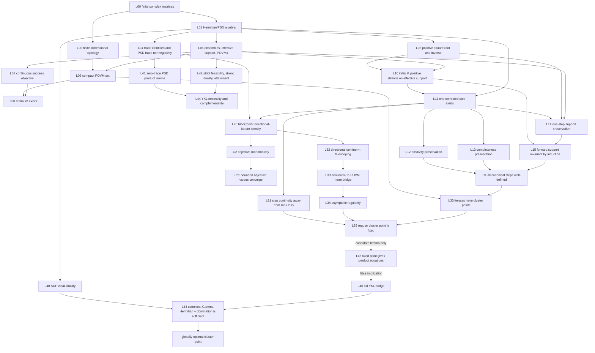

# Quantum Discrimination Iteration: Theorem Dossier

Status: preparatory, non-executable benchmark specification
Trust status: mathematical claims remain proposals until their cited sources are
checked for applicability or the claims are proved independently
Scope: benchmark-local research material; no core type, solver, numerical
experiment, or Lean implementation is introduced here

The normative, numbered targets extracted from this analysis are in
`BENCHMARK_STATEMENTS.md`.

## 1. Executive finding

The unrestricted target

> every trajectory of the Ježek–Řeháček–Fiurášek iteration has only globally
> optimal limit points

is false. A one-dimensional, two-label ensemble has a well-defined non-optimal
fixed point (Section 5.3). Any viable convergence theorem must constrain the
initial measurement, the state class, or both.

There is also a source-level specification defect. Equation (4) of the 2002
paper contains squared priors, but its displayed equation (5) contains only one
power of each prior. The literal pair does not preserve POVM completeness.
Later formulations use the squared-prior normalization. This dossier therefore
freezes two variants and never silently moves between them.

The benchmark's main unresolved target is the normalization-corrected iteration
from the unbiased/full-support initialization. The mixed-state global
convergence claim is not established by the sources reviewed here. A 2026 paper
reports a convergence theorem for pure-state ensembles under a support
initialization condition; its exact hypotheses must be checked from the full
article before that theorem can be imported.

## 2. Mathematical problem

### 2.1 Ensemble and effective space

Let \(I=\{1,\ldots,m\}\), with \(m\ge 1\), and let \(H\) be a complex Hilbert
space of finite dimension \(d\ge 1\). An ensemble is

\[
  \mathcal E=\{(p_i,\rho_i):i\in I\},
\]

where

\[
  p_i>0,\qquad \sum_i p_i=1,\qquad
  \rho_i\succeq0,\qquad \operatorname{Tr}\rho_i=1.
\]

Zero-prior labels are removed before the algorithm is defined. Put

\[
  W_i:=p_i\rho_i,
  \qquad
  H_{\mathcal E}:=\operatorname{supp}\!\left(\sum_iW_i\right).
\]

The benchmark works on \(H_{\mathcal E}\), not on an ambient space containing
an ensemble-invisible orthogonal summand. After this reduction,
\(\bigvee_i\operatorname{supp}(W_i)=H_{\mathcal E}\). Rank-deficient individual
states are still allowed.

### 2.2 Admissible measurements and objective

An admissible \(m\)-outcome measurement is a POVM

\[
  \mathsf{POVM}_m(H_{\mathcal E})
  :=\left\{M=(M_i)_i:M_i\succeq0,\ \sum_iM_i=I\right\}.
\]

Its success probability and error probability are

\[
  P_{\rm succ}(M)
    :=\sum_i\operatorname{Tr}(W_iM_i),
  \qquad
  P_{\rm err}(M):=1-P_{\rm succ}(M).
\]

Minimum-error discrimination is the finite-dimensional convex optimization
problem

\[
  P_*:=\max_{M\in\mathsf{POVM}_m(H_{\mathcal E})}P_{\rm succ}(M).
\]

The feasible set is nonempty and compact, and the objective is continuous, so
the maximum is attained. Normalization of the priors is needed for the
probability interpretation; multiplication of every \(W_i\) by the same
positive scalar does not change the optimizing POVMs.

## 3. Exact algorithm variants

### 3.1 `paper_literal`

The source locations are [Ježek–Řeháček–Fiurášek (2002), Eqs.
(4)--(5)](https://arxiv.org/html/quant-ph/0201109v1). In the paper's notation
they display

\[
  M_i^+=p_i^2\Lambda^{-1}\rho_iM_i\rho_i\Lambda^{-1}
\]

together with

\[
  \Lambda^2=\sum_i p_i\rho_iM_i\rho_i.
\]

Taken literally, these equations define neither a self-map of POVMs nor the
algorithm claimed in the surrounding prose, which asserts completeness
preservation immediately after Eq. (5). In dimension one, with
\(p=(1/3,2/3)\), \(\rho_1=\rho_2=1\), and \(M=(1/2,1/2)\), the printed
normalizer gives

\[
  \Lambda^2=\frac13\frac12+\frac23\frac12=\frac12,
  \qquad \Lambda^{-2}=2.
\]

Therefore the literal updates are

\[
  M_1^+=\left(\frac13\right)^2 2\frac12=\frac19,
  \qquad
  M_2^+=\left(\frac23\right)^2 2\frac12=\frac49,
\]

and \(M_1^++M_2^+=5/9\ne1\). This is exact algebra, not an inference that
Eq. (5) was typographically erroneous. The benchmark records the
inconsistency but does not assign an authorial intent beyond the displayed
formulas.

This variant exists only as a source-fidelity and semantic-alignment fixture.
It must not be repaired implicitly in a proof or implementation.

### 3.2 `normalization_corrected` (canonical benchmark variant)

For \(M\in\mathsf{POVM}_m(H_{\mathcal E})\), define

\[
  D_i(M):=W_iM_iW_i,
  \qquad
  K(M):=\sum_iD_i(M).
\]

When \(K(M)\succ0\) on \(H_{\mathcal E}\), define

\[
  T_{\mathcal E}(M)_i
  :=K(M)^{-1/2}D_i(M)K(M)^{-1/2}.
  \tag{JRF}
\]

Here \(K^{-1/2}\) is the unique positive-definite inverse square root. This is
the normalization forced by summing the updated effects. Its primary-source
cross-check is [Nakahira–Usuda–Kato (2015), Algorithm 1, steps
3–5](https://arxiv.org/pdf/1510.05202v1), which first forms
\(D_i=p_i^2\rho_iM_i\rho_i\), then applies the inverse square root of
\(\sum_iD_i\) on both sides. Tyson's [Definition 1 and Definition 8,
Eq. (17)](https://arxiv.org/html/0907.3386v4) instead writes the same quadratic
weighting with prior-weighted positive operators \(\operatorname{Tr}\rho_i=p_i\)
and a Moore–Penrose negative power. That notation maps to \(W_i\) here, but
its pseudoinverse semantics remain the separate variant in Section 3.3.

The frozen default initialization is

\[
  M_i^{(0)}=I/m,
  \qquad
  M^{(n+1)}=T_{\mathcal E}(M^{(n)}).
  \tag{INIT}
\]

Any theorem using a different initialization must say so in its statement.

### 3.3 `pseudoinverse_completed` (separate future variant)

Replacing \(K^{-1/2}\) with the Moore–Penrose inverse square root gives

\[
  \sum_iT_i(M)=P_{\operatorname{supp}K(M)},
\]

not necessarily \(I\). A full POVM then needs an explicit rule allocating
\(I-P_{\operatorname{supp}K(M)}\) among outcomes. Different allocation rules can
produce different dynamics. No such rule is canonical in this dossier, so the
pseudoinverse construction is not interchangeable with (JRF).
Tyson's Definition 1 permits \(\sum_iM_i\le I\), so Eq. (17) is complete under
his sub-POVM convention; this dossier's admissible measurements require exact
equality and therefore need the stated completion if support is lost.

### 3.4 Positive-scale bridge for Tyson's printed initialization

This subsection compares formulas; it does not declare every positive tuple to
be a POVM or sub-POVM. For a tuple \(M=(M_i)_i\) of positive semidefinite
operators, define the shared positive operator appearing in the normalized
updates by

\[
  S(M):=\sum_i W_iM_iW_i=K(M).
\]

The pseudoinverse formula is algebraically defined on such a tuple by

\[
  T^+(M)_i:=S(M)^{-1/2+}W_iM_iW_iS(M)^{-1/2+},
\]

where the Moore--Penrose negative power acts on
\(\operatorname{supp}S(M)\). The canonical ordinary-inverse formula (JRF) is
the same expression when \(S(M)\succ0\) on \(H_{\mathcal E}\), with the
ordinary inverse square root in place of the pseudoinverse.

Let \(c>0\). Componentwise linearity gives

\[
  W_i(cM_i)W_i=c\,W_iM_iW_i,
  \qquad
  S(cM)=cS(M).
\]

Positive scaling preserves the kernel and support, so
\(\operatorname{supp}(cS(M))=\operatorname{supp}S(M)\). Spectral calculus on
that common support gives

\[
  (cS(M))^{-1/2+}=c^{-1/2}S(M)^{-1/2+}.
\]

Consequently the scale factors cancel in every component:

\[
\begin{aligned}
  T^+(cM)_i
  &=(cS(M))^{-1/2+}\,cW_iM_iW_i\,(cS(M))^{-1/2+}\\
  &=c^{-1/2}S(M)^{-1/2+}\,cW_iM_iW_i\,
    c^{-1/2}S(M)^{-1/2+}\\
  &=T^+(M)_i.
\end{aligned}
\]

Thus \(T(cM)=T(M)\) for \(c>0\) for the pseudoinverse formula, provided both
sides use the same support convention, and for the ordinary-inverse formula
provided \(S(M)\succ0\); the latter condition is equivalent to
\(S(cM)\succ0\). In particular, the raw identity tuple
\(M_i^{\rm id}=I\) and the admissible uniform POVM
\(M_i^{\rm unif}=I/m\) have the same first updated iterate, because
\(M^{\rm id}=mM^{\rm unif}\). On the effective space,
\(S(M^{\rm unif})=m^{-1}\sum_iW_i^2\succ0\), so both ordinary-inverse first
successors also exist; without that full-support condition, only the
pseudoinverse formula with its explicit support convention is covered. This
conclusion is only an equality of their first successors under the algebraic
update. Tyson's Numerical Observation 9 literally prints \(M_k=I\); for
\(m>1\), that tuple satisfies
\(\sum_kM_k=mI\nleq I\) and therefore violates the sub-POVM condition in his
Definition 1. The normalized tuple \(M_k=I/m\) is admissible, but it is not the
literal initialization printed in Numerical Observation 9.

## 4. Helstrom/Yuen–Kennedy–Lax optimality map

Under A01--A06 below, the primal problem has the dual

\[
  \text{minimize }\operatorname{Tr}\Gamma
  \quad\text{subject to}\quad
  \Gamma=\Gamma^\dagger,\quad \Gamma\succeq W_i\ \text{for every }i.
\]

The finite-dimensional and finite-label assumptions are essential to this
formulation. Strict primal feasibility is witnessed by \(M_i=I/m\), and strict
dual feasibility by \(\Gamma=cI\) for any
\(c>\max_i\lambda_{\max}(W_i)\). Slater's theorem then gives equality and
attainment of the primal and dual optima. This is the specialization of
[Watrous's 2018 prepublication draft, Section 3.1, Eqs.
(3.37)--(3.42)](https://jhwatrous.github.io/TQI.double.pdf); the exact
downloaded-byte identity used for review is recorded in Section 11.
Weak duality is also immediate: for any primal-feasible \(M\) and dual-feasible
\(\Gamma\),

\[
  \operatorname{Tr}\Gamma-P_{\rm succ}(M)
  =\sum_i\operatorname{Tr}\!\left((\Gamma-W_i)M_i\right)\ge0.
  \tag{YKL-weak}
\]

For a POVM \(M\), define

\[
  \Gamma(M):=\sum_iW_iM_i.
\]

For a general POVM, \(\Gamma(M)\) need not be Hermitian. The
Holevo–Yuen–Kennedy–Lax theorem in [Watrous's 2018 prepublication draft,
Theorem 3.9](https://jhwatrous.github.io/TQI.double.pdf) says that \(M\) is globally
optimal if and only if

\[
  \Gamma(M)=\Gamma(M)^\dagger,
  \qquad
  \Gamma(M)-W_i\succeq0\quad\text{for every }i.
  \tag{YKL-dual}
\]

An equivalent certificate permits a separately supplied Hermitian operator
\(\Gamma\). It requires both dual feasibility and complementary slackness:

\[
  \Gamma=\Gamma^\dagger,
  \Gamma-W_i\succeq0,
  \qquad
  (\Gamma-W_i)M_i=M_i(\Gamma-W_i)=0
  \quad\text{for every }i,
  \tag{YKL-certificate}
\]

The left product equations and \(\sum_iM_i=I\) give
\(\Gamma=\sum_iW_iM_i=\Gamma(M)\); (YKL-weak) then gives sufficiency. Conversely,
strong duality and attainment give such a dual optimizer for every optimal
POVM, and complementary slackness gives the product equations. Thus necessity
and sufficiency here depend on finite-dimensional SDP duality, not on the JRF
iteration. Barnett and Croke state the pairwise and domination conditions as
their Eqs. (6)--(8), prove sufficiency in Eq. (9), and prove necessity in
Eqs. (10)--(16):

\[
  M_j(W_j-W_k)M_k=0
  \quad\text{for every }j,k,
\]

together with (YKL-dual). Pairwise extremality without (YKL-dual) is only a
stationarity condition.

The permitted conclusions are therefore:

- (YKL-dual), by itself, is necessary and sufficient because its operator is
  the canonical \(\Gamma(M)\);
- a separate \(\Gamma\) proves optimality only when it is Hermitian, dual
  feasible, and complementary to the POVM;
- global optimality implies both the canonical condition and the existence of
  a complementary dual optimizer;
- complementary-slackness products alone do not imply dual feasibility;
- pairwise extremality, JRF fixedness, monotone objective values, or a
  vanishing step residual do not imply global optimality.

The scalar witness in Section 5.3 satisfies the product equations for
\(\Gamma(M)\) but violates dual domination, making the failed implication
exact rather than merely unproved.

## 5. Three logically separate claims

### 5.1 Claim C1: every iteration is well-defined

Candidate statement, for the canonical trajectory only:

> If the ensemble is finite, all priors are positive, the space has been
> reduced to \(H_{\mathcal E}\), and (INIT) is used, then every \(K(M^{(n)})\)
> is positive definite. Consequently every iterate exists and remains a POVM.

The one-step feasibility part is immediate once \(K(M)\succ0\): each updated
effect is a positive congruence and

\[
  \sum_iT_{\mathcal E}(M)_i
  =K(M)^{-1/2}K(M)K(M)^{-1/2}=I.
\]

The global claim also needs a forward-invariance lemma. A proposed proof route
tracks \(\operatorname{supp}D_i(M^{(n)})\), beginning with
\(D_i(M^{(0)})=W_i^2/m\), and proves that these supports remain
\(\operatorname{supp}W_i\). Their join is the effective space, which makes
their sum positive definite. Nakahira–Usuda–Kato give this induction for their
more general update in Appendix A, Eqs. (A1)--(A2), using the support lemma in
Appendix B. Specializing their \(z_i\) to \(W_i\) is the proposed proof route,
but that specialization and every matrix-support step remain Lean obligations
here.

Status: literature-supported candidate; not formally checked in AdaIvy.

Without the effective-space or invertibility condition the claim is false. For
one rank-deficient state \(\rho=\operatorname{diag}(1,0)\) and the unique POVM
\(M_1=I\), \(K=\rho^2\) is singular on the unreduced ambient space.

### 5.2 Claim C2: the objective does not decrease

Candidate statement:

> Whenever a canonical JRF step \(M^+=T_{\mathcal E}(M)\) is well-defined,
> \(P_{\rm succ}(M^+)\ge P_{\rm succ}(M)\).

Tyson identifies the update with a directional iterate in Section 3.1,
Theorem 29, Eqs. (70)--(75), and derives monotonicity from the stronger
seminorm inequality in Lemma 7, Eq. (16). His ensemble operators already
include their priors, and his map uses the pseudoinverse convention of
Definition 8. The canonical ordinary-inverse step is the full-support
specialization. This gives a source-backed proof plan, not an AdaIvy formal
warrant.

Status: proved in the reviewed literature for the normalized directional
iterate; Lean proof not attempted.

Tyson's Numerical Observation 9 literally states the start \(M_k=I\), not the
admissible normalized start \(M_k=I/m\). For \(m>1\), the printed tuple violates
his Definition 1 sub-POVM condition; Section 3.4 proves only that positive-scale
invariance gives the two tuples the same first updated iterate. The convergence
claim in Eq. (19) remains a numerical observation; only monotonicity is derived
from directional iteration there. Nakahira–Usuda–Kato likewise state after
Eq. (37) that general-state convergence remained open in 2015. Neither source
supports upgrading C2 to any form of C3.

Consequences are deliberately limited. Since \(0\le P_{\rm succ}\le1\), the
scalar sequence \(P_{\rm succ}(M^{(n)})\) converges. This does not show that its
limit is \(P_*\), that \(M^{(n)}\) converges, that consecutive iterates approach
one another, or that any cluster point is stationary or optimal.

### 5.3 Claim C3: every limit point is globally optimal

Unrestricted statement:

> For every admissible initial POVM for which all steps exist, every limit
> point is globally optimal.

Status: **disproved**.

The following verification uses exact rational arithmetic.

1. **Finite ensemble and space.** Let \(H=\mathbb C\), so \(d=1\), and take
   two labels, so \(m=2\).
2. **States and priors.** Let \(\rho_1=\rho_2=1\),
   \(p_1=1/3\), and \(p_2=2/3\). Both states are positive semidefinite with
   trace one; both priors are positive and sum to one.
3. **Effective support.** Here

   \[
     W_1=\frac13,\qquad W_2=\frac23,\qquad
     \operatorname{supp}(W_1+W_2)=\mathbb C,
   \]

   so the example already satisfies the effective-space convention.
4. **Admissible initial measurement.** Set

\[
  M_1=1,\qquad M_2=0.
\]

   Both scalar effects are nonnegative and \(M_1+M_2=1\), so this boundary
   point is a valid POVM. It is deliberately not the uniform initialization
   (INIT); that is why it refutes the arbitrary-initialization statement but
   none of the narrower unbiased-initialization targets.
5. **Defined corrected step.** For the normalization-corrected variant,

\[
  D_1=W_1M_1W_1=\frac19,\qquad
  D_2=W_2M_2W_2=0,\qquad
  K=D_1+D_2=\frac19>0.
\]

   Thus the ordinary inverse square root exists and \(K^{-1/2}=3\). Direct
   substitution gives

   \[
     T(M)_1=3\frac19 3=1,\qquad
     T(M)_2=3(0)3=0.
   \]

   Equivalently, for any scalar POVM in the domain,

   \[
     T(M)_i=\frac{p_i^2M_i}{\sum_kp_k^2M_k}.
   \]

6. **Fixed trajectory and limit point.** Since \(T(M)=M\), induction gives
   \(M^{(n)}=M\) and \(K(M^{(n)})=1/9>0\) for every \(n\). Every claimed step
   exists. The sequence is constant, so in the operator-norm topology it
   converges to \(M\), which is its unique limit point.
7. **Exact global optimum.** Every scalar two-outcome POVM has the form
   \(N=(x,1-x)\) with \(0\le x\le1\), and

   \[
     P_{\rm succ}(N)
       =\frac13x+\frac23(1-x)
       =\frac23-\frac13x
       \le\frac23.
   \]

   Hence \(P_*=2/3\), attained at \(N=(0,1)\), whereas
   \(P_{\rm succ}(M)=1/3\). The fixed limit point has the exact positive
   suboptimality gap \(P_*-P_{\rm succ}(M)=1/3\).
8. **Exact YKL failure.** The canonical operator is

   \[
     \Gamma(M)=W_1M_1+W_2M_2=\frac13.
   \]

   It is Hermitian, and both complementary-slackness products vanish:

   \[
     (\Gamma(M)-W_1)M_1=0,\qquad
     (\Gamma(M)-W_2)M_2=\left(-\frac13\right)0=0.
   \]

   Nevertheless,

   \[
     \Gamma(M)-W_2=-\frac13<0,
   \]

   so (YKL-dual) fails. This simultaneously verifies that fixedness,
   existence of all iterates, convergence, zero step size, zero objective
   increment, and complementary slackness do not imply global optimality.

The following narrower targets must remain distinct:

- `C3-values-unbiased-mixed`: from (INIT), do objective values converge to
  \(P_*\) for every finite mixed-state ensemble?
- `C3-cluster-unbiased-mixed`: from (INIT), is every cluster point optimal?
- `C3-iterates-unbiased-mixed`: from (INIT), do the POVM iterates converge to
  one optimal POVM?
- `C3-pure-support`: under the exact support condition of the 2026 pure-state
  theorem, do the iterates converge to an optimal measurement?

The sources reviewed here do not establish any of the three mixed-state
targets. The official 2026 abstract reports the pure-state result only; the
full theorem statement and its definition mapping must be acquired and checked
before `C3-pure-support` is treated as an imported premise.

## 6. Assumption ledger

| ID | Assumption | Needed for | Failure if omitted |
|---|---|---|---|
| A01 | finite label set | finite sums, compact POVM product | infinite-outcome theory is different |
| A02 | finite-dimensional complex space | compactness, matrix square roots, SDP attainment | infinite-dimensional compactness/attainment may fail |
| A03 | \(\rho_i\succeq0\), \(\operatorname{Tr}\rho_i=1\) | state semantics | objective is not state-discrimination probability |
| A04 | \(p_i>0\), \(\sum p_i=1\) | probability semantics and support arguments | zero labels create degenerate dynamics |
| A05 | reduce to joint ensemble support | inverse semantics | invisible ambient directions make \(K\) singular |
| A06 | POVM positivity and exact completeness | admissible measurement | sub-POVM or nonpositive effects change the problem |
| A07 | squared-prior normalization | self-map of POVMs | literal 2002 equations fail normalization |
| A08 | \(K(M^{(n)})\succ0\) at each step | ordinary inverse square root | update is undefined |
| A09 | (INIT), or another stated support condition | forward well-definedness/global target | boundary POVMs include non-optimal fixed points |
| A10 | exact arithmetic for the theorem | algebraic equalities and PSD order | floating residuals are not proofs |
| A11 | a named matrix norm/topology | limit point and convergence statements | “converges” is ambiguous |
| A12 | no uniqueness assumption | correct conclusion shape | optimum and limit point need not be unique |
| A13 | continuity/asymptotic regularity hypotheses | cluster point implies fixed point | monotone values alone are insufficient |
| A14 | full YKL bridge: \(\Gamma(M)\) Hermitian and \(\Gamma(M)\succeq W_i\) for every \(i\), or an equivalent dual-feasible complementary certificate | fixed/stationary implies global optimum | scalar counterexample satisfies product equations but violates domination |

In finite dimension all matrix norms induce the same topology, but the Lean
statement should select one norm explicitly. Numerical protocols may use a
different norm only with a recorded comparison bound.

## 7. Lean-oriented lemma dependency graph



Neither dashed edge is available by default. In particular,
product/complementarity equations do not imply the full YKL bridge; that
implication is false by Section 5.3. Also, objective monotonicity does not
directly imply asymptotic regularity of the POVMs: the directional-iterate
estimate first controls a generalized-measurement seminorm, so L33 must supply
a separately proved norm/representation bridge. A full convergence theorem
must discharge both gaps under stated hypotheses.

Recommended initial Lean representation:

```lean
abbrev Mat (d : ℕ) := Matrix (Fin d) (Fin d) ℂ

def IsDensity (ρ : Mat d) : Prop :=
  ρ.PosSemidef ∧ ρ.trace = 1

def IsPOVM (M : Fin m → Mat d) : Prop :=
  (∀ i, (M i).PosSemidef) ∧ ∑ i, M i = 1
```

Keep `IsPOVM` as a predicate initially. Model a JRF step as a partial relation
with an explicit positive-definite square root, rather than a total function
whose matrix inverse silently returns a value on singular input.

## 8. Preliminary Lean benchmarks

Attempt B00--B14 in order, recording exact statement hashes, imports, axioms,
warnings, and failures under ADR-0015's restricted checker policy. These are
frozen future theorem statements; “prove” below names a future benchmark
disposition, not a proof already held by AdaIvy. B15 is different: it is a
bounded conjecture-family and statement-construction target, not yet a theorem
statement and not eligible for proof execution.

| Level | Benchmark target | Required hypotheses and dependencies | Disposition |
|---:|---|---|---|
| B00 | The literal 2002 Eq. (4)--(5) scalar update has \(M_1^+=1/9\), \(M_2^+=4/9\), hence \(M_1^++M_2^+=5/9\ne1\) | exact reals; \(p=(1/3,2/3)\), \(\rho=(1,1)\), \(M=(1/2,1/2)\), \(\Lambda>0\), \(\Lambda^2=1/2\); only ordered-field and square-root algebra | prove exact source-alignment counterexample |
| B01 | The unreduced \(d=2,m=1\) example \(\rho=\operatorname{diag}(1,0)\), \(M_1=I\) has singular \(K=\rho^2\) | no effective-support reduction; determinant or explicit kernel witness | prove exact partiality counterexample |
| B02 | The Section 5.3 scalar POVM is a defined, constant, non-optimal trajectory with gap \(1/3\) and failed YKL domination | exact scalar corrected map; all eight checks in Section 5.3 | prove exact refutation certificate |
| B03 | The corrected scalar update preserves the probability simplex | \(p_i>0\), \(M_i\ge0\), \(\sum_iM_i=1\); prove \(\sum_i p_i^2M_i>0\) before division | prove |
| B04 | The corrected scalar success probability is nondecreasing | B03; pairwise covariance inequality for \(p_i\) and \(p_i^2\) | prove |
| B05 | Scalar full-support iterates have \(M_i^{(n)}=p_i^{2n}M_i^{(0)}/\sum_jp_j^{2n}M_j^{(0)}\) and converge to the maximal-prior face | B03; \(M_i^{(0)}>0\); ties retain normalized initial weights on the maximal-prior indices; a unique maximum gives the corresponding vertex | prove restricted convergence theorem |
| B06 | PSD is preserved by congruence | finite complex matrices and Hermitian/PSD definitions | prove or reuse a checked library theorem |
| B07 | One corrected matrix step is a POVM | B06; input POVM; \(K(M)\succ0\); positive inverse-square-root identities | prove C1's local core only |
| B08 | The uniform first iterate has \(K_0=m^{-1}\sum_iW_i^2\) and the corresponding quadratically weighted effects | effective-support reduction; B07; prove \(K_0\succ0\) | prove semantic-alignment statement |
| B09 | SDP weak duality (YKL-weak) | finite \(m,d\); primal POVM; Hermitian \(\Gamma\succeq W_i\); PSD trace nonnegativity | prove |
| B10 | The canonical YKL condition is sufficient for global optimality | B09; \(\Gamma(M)\) Hermitian and \(\Gamma(M)\succeq W_i\) for every \(i\) | prove |
| B11 | The finite POVM feasible set is nonempty and compact and \(P_*\) is attained | finite \(m,d\); exact POVM constraints; continuous objective | prove |
| B12 | Commuting diagonal ensembles reduce coordinatewise to classical decision problems | simultaneous diagonalization hypotheses stated explicitly; B09--B11 as needed | prove intermediate special case |
| B13 | YKL necessity and complementary-slackness equivalence | B09, B11, strict primal/dual feasibility, strong duality, dual attainment, zero-trace PSD product lemma | prove harder convex-analysis theorem |
| B14 | A defined corrected matrix step is objective-nondecreasing | exact mapping from prior-weighted operators; directional-iterate identity; pseudoinverse/ordinary-inverse specialization checked | prove source-backed C2 target |
| B15 | Construct one or more exact pure-state support-conditioned convergence statements from the bounded conjecture family described in Section 5.3 | acquire and align the exact full-text theorem, hypotheses, definitions, initialization, support condition, algorithm variant, topology, and conclusion before freezing any statement | deferred statement-construction target; not a theorem statement |

B15 remains bounded to the pure-state/support-conditioned family identified in
Section 5.3. Its permitted work is source acquisition, semantic alignment, and
construction of candidate statements with explicit quantifiers. It must not be
reported as a theorem statement, proof benchmark, imported premise, or proved
result until one exact statement passes those gates.

The following are **rejected conjectures**, not proof benchmarks:

- the literal Eq. (4)--(5) pair is a POVM self-map (refuted by B00);
- the ordinary-inverse update is total on arbitrary ambient-space POVMs
  (refuted by B01);
- every fixed point is globally optimal (refuted by B02);
- every arbitrary-initialization limit point is globally optimal (refuted by
  B02).

The full mixed-state convergence theorem is not a legitimate proof benchmark
until its initialization and state-class hypotheses exclude B02. A version
retaining B02's quantifiers is legitimate only as a disproof benchmark.

### Smallest safe first executable benchmark

The proposed first executable benchmark is **B00**. It is smaller than the
quantum and convergence targets: it needs no matrices, POVM library, optimizer,
topology, pseudoinverse, numerical tolerance, or imported convergence theorem.
Its acceptance statement is exactly the scalar calculation in Section 3.1,
including \(\Lambda>0\), \(\Lambda^2=1/2\), the two updated values, and the
failed normalization \(5/9\ne1\). It must be presented as a theorem proving a
counterexample to the literal source equations, never as an implementation of
the normalization-corrected iteration. This dossier identifies B00 only; no
executable artifact is introduced in this pass.

## 9. Mathematical convergence versus numerical stopping

These mathematical statements are distinct:

1. every step exists;
2. \(P_{\rm succ}(M^{(n)})\) is monotone;
3. the scalar objective values converge;
4. the objective limit equals \(P_*\);
5. the iterates are asymptotically regular;
6. the iterates have cluster points;
7. every cluster point is fixed or stationary;
8. every cluster point satisfies YKL;
9. the distance to the optimal set tends to zero;
10. the POVM sequence converges to one optimal POVM.

No item is to be reported as a synonym for a later item.

A numerical run may record:

- POVM feasibility residuals;
- \(\lVert M^{(n+1)}-M^{(n)}\rVert\);
- \(|P_{n+1}-P_n|\);
- the smallest eigenvalue of \(K(M^{(n)})\);
- a Hermiticity residual for \(\Gamma(M^{(n)})\);
- the minimum eigenvalues of \(\Gamma-W_i\);
- complementary-slackness residuals;
- a certified primal–dual gap;
- precision, tolerance policy, iteration cap, and stop reason.

Small step size or small objective change is only heuristic stagnation; the
non-optimal fixed point makes both exactly zero. A proof-grade numerical stop
requires a dual-feasible \(\Gamma\) and a rigorous primal–dual gap, with exact or
interval-certified PSD checks. One generic candidate is

\[
  \Gamma_0:=\operatorname{Herm}\!\left(\sum_iW_iM_i\right),
  \quad
  c:=\max_i\max\{0,-\lambda_{\min}(\Gamma_0-W_i)\},
  \quad
  \Gamma:=\Gamma_0+cI.
\]

When the eigenvalue bounds are rigorous, \(\Gamma\) is dual feasible and
\(\operatorname{Tr}\Gamma-P_{\rm succ}(M)\) is a certified upper bound on
suboptimality. Floating-point output without an error enclosure remains a
candidate artifact. A small upper bound certifies near-optimality; a positive
upper bound alone does not certify that \(M\) is non-optimal.

## 10. Counterexample-search specifications

All searches are exploratory. They must freeze the algorithm variant,
parameterization, seed, precision, tolerances, and stopping rules before each
run. A floating hit never by itself refutes a universal claim.

### Gates required before any search result can be interpreted

1. **Claim gate.** Freeze one claim, including every quantifier, initialization
   class, state class, topology, and conclusion. A witness outside those
   hypotheses is irrelevant to that claim.
2. **Variant gate.** Record whether the run uses paper-literal,
   normalization-corrected ordinary-inverse, or a named pseudoinverse
   completion. Results may not cross variant boundaries.
3. **Feasibility gate.** Verify the ensemble, effective support, and every POVM
   constraint for the same candidate. Zero priors must be either rejected or
   removed by the frozen preprocessing rule.
4. **Domain gate.** For every step used in the conclusion, certify
   \(K(M^{(n)})\succ0\) for the ordinary-inverse variant, or certify the exact
   support and completion rule for a pseudoinverse variant.
5. **Conclusion gate.** A fixed-point or cycle candidate needs an independent
   failure certificate: a strictly better feasible POVM, a matching
   primal/dual certificate fixing \(P_*\) above the candidate, or a direct
   failure of the necessary-and-sufficient canonical YKL condition (including
   non-Hermiticity or a rigorously negative domination eigenvalue). A positive
   gap to an arbitrary dual-feasible bound is insufficient.
6. **Promotion gate.** Floating-point candidates remain exploratory until
   rational/algebraic reconstruction or interval bounds certify all PSD,
   equality, separation, and objective assertions. A tolerance-rounded zero
   is not an equality.
7. **Initialization gate.** Boundary, full-support, and (INIT) searches are
   separate suites. No result from one suite changes the status of a theorem
   quantified over another.
8. **Negative-result gate.** Failure to find a witness is recorded as a bounded
   failed search, never as evidence that a universal theorem is true.

### CE-CYCLE: cycles of period 2 through 8

- Search \(T^q(M)=M\) for \(2\le q\le8\), while requiring a positive separation
  from all smaller periods.
- Monotonicity forces a genuine cycle to lie on an objective plateau; target
  tied priors, nonunique optima, rank-changing limits, and boundary effects.
- Record every intermediate POVM, \(K\)-spectrum, and objective.
- Promote only after exact/algebraic reconstruction or interval certification
  of feasibility, period, and separation.

### CE-FIXED: non-optimal fixed points

- Solve or minimize the fixed-point residual subject to a strictly better
  feasible POVM, an exact optimum certificate with a positive objective gap,
  or a certified failure of the canonical YKL condition.
- Include the scalar example in Section 5.3 as the mandatory positive control.
- Run separate suites from boundary, full-support random, and unbiased
  initializations; never generalize a boundary result to (INIT) silently.

### CE-BOUNDARY: boundary and nonuniqueness cases

- zero effects and effects approaching rank loss;
- zero priors before preprocessing;
- identical states, tied priors, orthogonal states, and dominated labels;
- ensembles that do not span the ambient space;
- unique versus nonunique optimal POVMs;
- \(\lambda_{\min}(K)\) approaching zero.

### CE-RANK: rank-deficient mixed states

- Generate rational or algebraic PSD matrices of controlled ranks and
  overlapping support patterns.
- Compare ambient-space, effective-support, and explicitly completed
  pseudoinverse semantics as different experiments.
- Search for loss of forward invertibility, objective decreases, suboptimal
  fixed points, and plateau cycles.
- Preserve failed reconstruction and missing-certificate outcomes as results.

### Required witness package

A promotable counterexample contains:

- the frozen claim and algorithm-variant identifiers;
- exact ensemble, effective-space, initialization, and POVM data;
- a line-by-line proof that every hypothesis holds for that same data;
- a proof that every claimed step is defined under the frozen inverse
  semantics;
- exact or interval-certified fixedness, period, or limit assertions, including
  separation from all smaller periods for a cycle;
- an independently certified objective gap or YKL failure;
- the arithmetic domain, precision and enclosure policy, and reconstruction
  record; and
- all failed reconstruction or certification attempts.

Promotion is permitted only when the same witness satisfies the claim's
assumptions and violates its conclusion. Approximate stagnation, an uncertified
negative eigenvalue, solver disagreement, or model agreement is insufficient.

## 11. Source applicability ledger

Reproducible source identities used for this review are:

- Ježek–Řeháček–Fiurášek: arXiv `quant-ph/0201109v1`;
- Tyson: arXiv `0907.3386v4`;
- Nakahira–Usuda–Kato: arXiv `1510.05202v1`;
- Barnett–Croke: arXiv `0810.1919v1`;
- Lü–Dong: *Physical Review A* **113**, 022451 (2026),
  DOI `10.1103/q7wq-ygm9`; only the official abstract was reviewed; and
- Watrous: John Watrous, *The Theory of Quantum Information*, ©2018,
  visibly labeled “draft, pre-publication copy.” No official immutable
  identifier for these exact draft bytes was established, so the referenced
  bytes are fixed instead by URL
  `https://jhwatrous.github.io/TQI.double.pdf`, UTC access time
  `2026-08-20T07:22:47Z`, byte length `2908202`, and SHA-256
  `d947c05c29295357689cc798fe80dc0e4509e1706b2ed117a6cc913fd52debbc`.
  This identity does not substitute the later published book.

| Source | Use in this dossier | Applicability status |
|---|---|---|
| [Ježek, Řeháček, Fiurášek (2002), arXiv v1](https://arxiv.org/html/quant-ph/0201109v1) | objective and POVM constraints, Eqs. (1)--(2); printed update/normalizer, Eqs. (4)--(5); stationarity and optimality warning following Eq. (5); complementary slackness and Helstrom domination, Eqs. (9)--(10); convergence-problem warnings after Eq. (8) and in the conclusion | displayed formulas checked; Eq. (4)--(5) normalization inconsistency and the paper's separate completeness assertion recorded without guessing authorial intent |
| [Tyson (2010), arXiv v4](https://arxiv.org/html/0907.3386v4) | prior-weighted ensemble convention, Definition 1, Eqs. (2)--(4); pseudoinverse JRF map, Definition 8, Eqs. (17)--(18); directional monotonicity, Lemma 7 Eq. (16) and Section 3.1 Theorem 29, Eqs. (70)--(75); convergence claim labeled Numerical Observation 9, Eq. (19) | notation mapping to \(W_i\) checked; Numerical Observation 9's literal \(M_k=I\) start violates Definition 1 for \(m>1\), while Section 3.4 proves only equality of its first successor with the admissible \(I/m\) start; pseudoinverse/sub-POVM semantics are not silently imported into the canonical ordinary-inverse variant; full Lean proof mapping remains open |
| [Nakahira, Usuda, Kato (2015), arXiv v1](https://arxiv.org/pdf/1510.05202v1) | squared-prior update, Algorithm 1 steps 3--5; support induction, Appendices A--B; general-state convergence stated open after Eq. (37) | algorithm normalization and stated scope checked; the generalized support proof still requires an explicit specialization to this dossier |
| [Watrous, *The Theory of Quantum Information*, 2018 prepublication draft](https://jhwatrous.github.io/TQI.double.pdf) | finite-dimensional state-discrimination SDP and Slater witnesses, Section 3.1 Eqs. (3.37)--(3.42); canonical YKL equivalence, Theorem 3.9 Eqs. (3.43)--(3.47) | exact URL and downloaded-byte identity are recorded above; checked for finite alphabet and finite-dimensional complex space; necessity and sufficiency mapped explicitly in Section 4; the later published book was not substituted |
| [Barnett and Croke (2009), arXiv v1](https://arxiv.org/pdf/0810.1919v1) | pairwise and domination conditions, Eqs. (6)--(8); sufficiency, Eq. (9); necessity, Eqs. (10)--(16) | supporting primary derivation checked; pairwise equations are not treated as sufficient without domination |
| [Lü and Dong, *Phys. Rev. A* **113**, 022451 (2026), DOI `10.1103/q7wq-ygm9`](https://journals.aps.org/pra/abstract/10.1103/q7wq-ygm9) | abstract-reported pure-state convergence theorem | official abstract only; not admissible as a load-bearing imported theorem until the full text and exact hypotheses are checked |

No downloaded paper bytes are committed. These links are provenance pointers,
not accepted mathematical warrants. Formal validity, source applicability,
semantic alignment, numerical evidence, novelty, and significance remain
separate assessments.

## 12. Benchmark exit condition for this dossier

This review-only specification pass is accepted only when all of the following
are true:

1. The literal source pair is tied to JRF Eqs. (4)--(5), its \(5/9\)
   normalization failure is reproduced exactly, and no authorial correction is
   asserted without evidence.
2. The canonical corrected map uses
   \(K=\sum_iW_iM_iW_i\), requires \(K\succ0\), and is not conflated with
   Tyson's pseudoinverse/sub-POVM convention or an unspecified completion.
3. Every item in the eight-part scalar audit in Section 5.3 is checked for the
   same witness: ensemble, support, POVM, step domain, update, full trajectory,
   optimum gap, and YKL failure.
4. The unrestricted arbitrary-initialization global-limit claim and the
   implication “fixed point implies optimum” are marked false, while the three
   uniform-initialized mixed-state questions remain separate and open.
5. The YKL map states finite \(m,d\), primal and dual feasibility, Slater
   witnesses, attainment, necessity, and sufficiency. It never substitutes
   complementarity, pairwise extremality, fixedness, or monotonicity for dual
   domination.
6. The lemma graph contains explicit bridges for forward support invariance,
   generalized-measurement seminorm to POVM norm, strong duality, and full YKL
   feasibility; false or candidate implications are dashed and labeled.
7. Every B00--B14 row gives a frozen future theorem statement, its required
   hypotheses/dependencies, and its disposition. B15 is separately labeled as
   a bounded conjecture-family and statement-construction target with no frozen
   theorem statement. Rejected conjectures are outside the proof ladder.
8. B00 alone is identified as the smallest safe first executable benchmark,
   with no executable work performed.
9. Counterexample promotion is blocked until all claim, variant, feasibility,
   domain, conclusion, reconstruction, initialization, and negative-result
   gates in Section 10 are satisfied.
10. Mathematical convergence levels and numerical stop conditions remain
    distinct; a small residual or failed search never changes theorem status.
11. Every load-bearing source claim names a primary-source theorem, equation,
    algorithm step, or appendix and records any notation/applicability gap.
12. The diff is documentation-only, the documented offline checks pass, and no
    Phase 3B or Phase 4 checkout is touched.

It does not claim to implement the iteration, run a numerical search, import a
paper theorem as trusted, or settle the unbiased mixed-state convergence
question.
