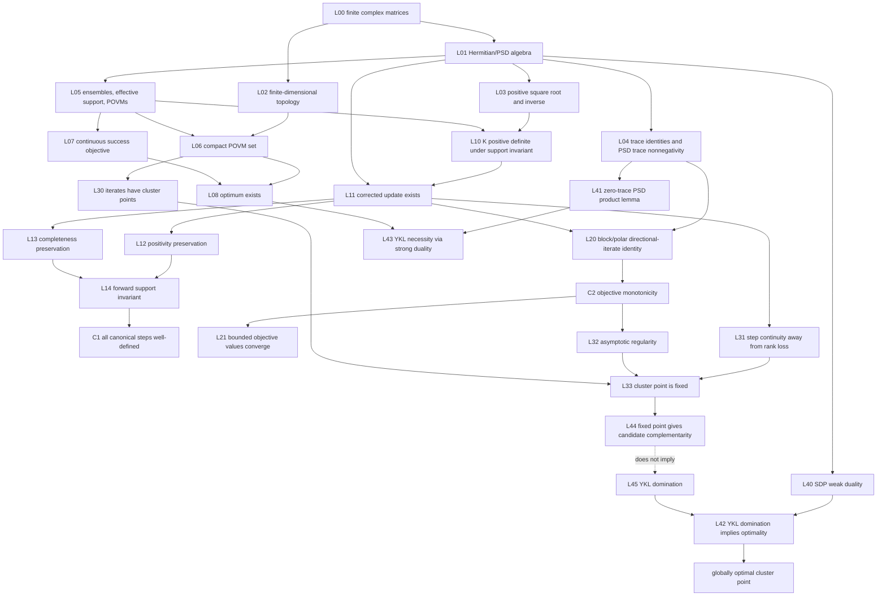

# Quantum Discrimination Iteration: Theorem Dossier

Status: preparatory, non-executable benchmark specification
Trust status: mathematical claims remain proposals until their cited sources are
checked for applicability or the claims are proved independently
Scope: benchmark-local research material; no core type, solver, numerical
experiment, or Lean implementation is introduced here

## 1. Executive finding

The unrestricted target

> every trajectory of the Ježek–Řeháček–Fiurášek iteration has only globally
> optimal limit points

is false. A one-dimensional, two-label ensemble has a well-defined non-optimal
fixed point (Section 5.3). Any viable convergence theorem must constrain the
initial measurement, the state class, or both.

There is also a source-level specification defect. Equation (4) of the 2002
paper contains squared priors, but its displayed equation (5) contains only one
power of each prior. The literal pair does not preserve POVM completeness.
Later formulations use the squared-prior normalization. This dossier therefore
freezes two variants and never silently moves between them.

The benchmark's main unresolved target is the normalization-corrected iteration
from the unbiased/full-support initialization. The mixed-state global
convergence claim is not established by the sources reviewed here. A 2026 paper
reports a convergence theorem for pure-state ensembles under a support
initialization condition; its exact hypotheses must be checked from the full
article before that theorem can be imported.

## 2. Mathematical problem

### 2.1 Ensemble and effective space

Let \(I=\{1,\ldots,m\}\), with \(m\ge 1\), and let \(H\) be a complex Hilbert
space of finite dimension \(d\ge 1\). An ensemble is

\[
  \mathcal E=\{(p_i,\rho_i):i\in I\},
\]

where

\[
  p_i>0,\qquad \sum_i p_i=1,\qquad
  \rho_i\succeq0,\qquad \operatorname{Tr}\rho_i=1.
\]

Zero-prior labels are removed before the algorithm is defined. Put

\[
  W_i:=p_i\rho_i,
  \qquad
  H_{\mathcal E}:=\operatorname{supp}\!\left(\sum_iW_i\right).
\]

The benchmark works on \(H_{\mathcal E}\), not on an ambient space containing
an ensemble-invisible orthogonal summand. After this reduction,
\(\bigvee_i\operatorname{supp}(W_i)=H_{\mathcal E}\). Rank-deficient individual
states are still allowed.

### 2.2 Admissible measurements and objective

An admissible \(m\)-outcome measurement is a POVM

\[
  \mathsf{POVM}_m(H_{\mathcal E})
  :=\left\{M=(M_i)_i:M_i\succeq0,\ \sum_iM_i=I\right\}.
\]

Its success probability and error probability are

\[
  P_{\rm succ}(M)
    :=\sum_i\operatorname{Tr}(W_iM_i),
  \qquad
  P_{\rm err}(M):=1-P_{\rm succ}(M).
\]

Minimum-error discrimination is the finite-dimensional convex optimization
problem

\[
  P_*:=\max_{M\in\mathsf{POVM}_m(H_{\mathcal E})}P_{\rm succ}(M).
\]

The feasible set is nonempty and compact, and the objective is continuous, so
the maximum is attained. Normalization of the priors is needed for the
probability interpretation; multiplication of every \(W_i\) by the same
positive scalar does not change the optimizing POVMs.

## 3. Exact algorithm variants

### 3.1 `paper_literal`

The 2002 paper displays

\[
  M_i^+=p_i^2\Lambda^{-1}\rho_iM_i\rho_i\Lambda^{-1}
\]

together with

\[
  \Lambda^2=\sum_i p_i\rho_iM_i\rho_i.
\]

Taken literally, these equations define neither a self-map of POVMs nor the
algorithm claimed in the surrounding prose. In dimension one, with
\(p=(1/3,2/3)\), \(\rho_1=\rho_2=1\), and \(M=(1/2,1/2)\), the sum of the two
updated effects is \(5/9\), not \(1\).

This variant exists only as a source-fidelity and semantic-alignment fixture.
It must not be repaired implicitly in a proof or implementation.

### 3.2 `normalization_corrected` (canonical benchmark variant)

For \(M\in\mathsf{POVM}_m(H_{\mathcal E})\), define

\[
  D_i(M):=W_iM_iW_i,
  \qquad
  K(M):=\sum_iD_i(M).
\]

When \(K(M)\succ0\) on \(H_{\mathcal E}\), define

\[
  T_{\mathcal E}(M)_i
  :=K(M)^{-1/2}D_i(M)K(M)^{-1/2}.
  \tag{JRF}
\]

Here \(K^{-1/2}\) is the unique positive-definite inverse square root. This is
the normalization forced by summing the updated effects, and it agrees with
later pseudocode that first forms \(D_i=p_i^2\rho_iM_i\rho_i\).

The frozen default initialization is

\[
  M_i^{(0)}=I/m,
  \qquad
  M^{(n+1)}=T_{\mathcal E}(M^{(n)}).
  \tag{INIT}
\]

Any theorem using a different initialization must say so in its statement.

### 3.3 `pseudoinverse_completed` (separate future variant)

Replacing \(K^{-1/2}\) with the Moore–Penrose inverse square root gives

\[
  \sum_iT_i(M)=P_{\operatorname{supp}K(M)},
\]

not necessarily \(I\). A full POVM then needs an explicit rule allocating
\(I-P_{\operatorname{supp}K(M)}\) among outcomes. Different allocation rules can
produce different dynamics. No such rule is canonical in this dossier, so the
pseudoinverse construction is not interchangeable with (JRF).

## 4. Helstrom/Yuen–Kennedy–Lax optimality map

The primal problem above has the dual

\[
  \text{minimize }\operatorname{Tr}\Gamma
  \quad\text{subject to}\quad
  \Gamma=\Gamma^\dagger,\quad \Gamma\succeq W_i\ \text{for every }i.
\]

Finite dimension gives primal and dual strict feasibility, attainment, and
strong duality. For a POVM \(M\), define

\[
  \Gamma(M):=\sum_iW_iM_i.
\]

The Holevo–Yuen–Kennedy–Lax (YKL) conditions say that \(M\) is globally
optimal if and only if

\[
  \Gamma(M)=\Gamma(M)^\dagger,
  \qquad
  \Gamma(M)-W_i\succeq0\quad\text{for every }i.
  \tag{YKL-dual}
\]

At optimum these are equivalent to the dual-feasibility and complementary-
slackness system

\[
  \Gamma-W_i\succeq0,
  \qquad
  (\Gamma-W_i)M_i=M_i(\Gamma-W_i)=0
  \quad\text{for every }i,
  \tag{YKL-CS}
\]

and to the pairwise extremal equations

\[
  M_j(W_j-W_k)M_k=0
  \quad\text{for every }j,k,
\]

together with (YKL-dual).

This split is central to the benchmark. The JRF fixed-point/extremal equations
may yield complementary slackness on active outcomes, but they do not by
themselves yield \(\Gamma\succeq W_i\). That missing inequality is exactly why a
fixed point can be non-optimal.

## 5. Three logically separate claims

### 5.1 Claim C1: every iteration is well-defined

Candidate statement, for the canonical trajectory only:

> If the ensemble is finite, all priors are positive, the space has been
> reduced to \(H_{\mathcal E}\), and (INIT) is used, then every \(K(M^{(n)})\)
> is positive definite. Consequently every iterate exists and remains a POVM.

The one-step feasibility part is immediate once \(K(M)\succ0\): each updated
effect is a positive congruence and

\[
  \sum_iT_{\mathcal E}(M)_i
  =K(M)^{-1/2}K(M)K(M)^{-1/2}=I.
\]

The global claim also needs a forward-invariance lemma. A proposed proof route
tracks \(\operatorname{supp}D_i(M^{(n)})\), beginning with
\(D_i(M^{(0)})=W_i^2/m\), and proves that these supports remain
\(\operatorname{supp}W_i\). Their join is the effective space, which makes
their sum positive definite. This argument is present in later algorithmic
work, but it remains a Lean obligation here.

Status: literature-supported candidate; not formally checked in AdaIvy.

Without the effective-space or invertibility condition the claim is false. For
one rank-deficient state \(\rho=\operatorname{diag}(1,0)\) and the unique POVM
\(M_1=I\), \(K=\rho^2\) is singular on the unreduced ambient space.

### 5.2 Claim C2: the objective does not decrease

Candidate statement:

> Whenever a canonical JRF step \(M^+=T_{\mathcal E}(M)\) is well-defined,
> \(P_{\rm succ}(M^+)\ge P_{\rm succ}(M)\).

Tyson identifies the update with a directional iterate and derives
monotonicity from a stronger seminorm inequality. This gives a source-backed
proof plan, not an AdaIvy formal warrant.

Status: proved in the reviewed literature for the normalized directional
iterate; Lean proof not attempted.

Consequences are deliberately limited. Since \(0\le P_{\rm succ}\le1\), the
scalar sequence \(P_{\rm succ}(M^{(n)})\) converges. This does not show that its
limit is \(P_*\), that \(M^{(n)}\) converges, that consecutive iterates approach
one another, or that any cluster point is stationary or optimal.

### 5.3 Claim C3: every limit point is globally optimal

Unrestricted statement:

> For every admissible initial POVM for which all steps exist, every limit
> point is globally optimal.

Status: **disproved**.

Exact counterexample: let \(H=\mathbb C\), let
\(\rho_1=\rho_2=1\), take \(p_1=1/3\), \(p_2=2/3\), and initialize

\[
  M_1=1,\qquad M_2=0.
\]

Then \(K=1/9>0\) and the normalization-corrected update is

\[
  T(M)_i=\frac{p_i^2M_i}{\sum_kp_k^2M_k},
\]

so \(T(M)=M\). The constant trajectory has success probability \(1/3\), while
the POVM \((0,1)\) has success probability \(2/3=P_*\). The fixed point fails
YKL dual feasibility because its active multiplier is \(1/3<W_2=2/3\).

The following narrower targets must remain distinct:

- `C3-values-unbiased-mixed`: from (INIT), do objective values converge to
  \(P_*\) for every finite mixed-state ensemble?
- `C3-cluster-unbiased-mixed`: from (INIT), is every cluster point optimal?
- `C3-iterates-unbiased-mixed`: from (INIT), do the POVM iterates converge to
  one optimal POVM?
- `C3-pure-support`: under the exact support condition of the 2026 pure-state
  theorem, do the iterates converge to an optimal measurement?

The sources reviewed here do not establish any of the three mixed-state
targets. The official 2026 abstract reports the pure-state result only; the
full theorem statement and its definition mapping must be acquired and checked
before `C3-pure-support` is treated as an imported premise.

## 6. Assumption ledger

| ID | Assumption | Needed for | Failure if omitted |
|---|---|---|---|
| A01 | finite label set | finite sums, compact POVM product | infinite-outcome theory is different |
| A02 | finite-dimensional complex space | compactness, matrix square roots, SDP attainment | infinite-dimensional compactness/attainment may fail |
| A03 | \(\rho_i\succeq0\), \(\operatorname{Tr}\rho_i=1\) | state semantics | objective is not state-discrimination probability |
| A04 | \(p_i>0\), \(\sum p_i=1\) | probability semantics and support arguments | zero labels create degenerate dynamics |
| A05 | reduce to joint ensemble support | inverse semantics | invisible ambient directions make \(K\) singular |
| A06 | POVM positivity and exact completeness | admissible measurement | sub-POVM or nonpositive effects change the problem |
| A07 | squared-prior normalization | self-map of POVMs | literal 2002 equations fail normalization |
| A08 | \(K(M^{(n)})\succ0\) at each step | ordinary inverse square root | update is undefined |
| A09 | (INIT), or another stated support condition | forward well-definedness/global target | boundary POVMs include non-optimal fixed points |
| A10 | exact arithmetic for the theorem | algebraic equalities and PSD order | floating residuals are not proofs |
| A11 | a named matrix norm/topology | limit point and convergence statements | “converges” is ambiguous |
| A12 | no uniqueness assumption | correct conclusion shape | optimum and limit point need not be unique |
| A13 | continuity/asymptotic regularity hypotheses | cluster point implies fixed point | monotone values alone are insufficient |
| A14 | YKL dual domination | fixed/stationary implies global optimum | scalar counterexample violates it |

In finite dimension all matrix norms induce the same topology, but the Lean
statement should select one norm explicitly. Numerical protocols may use a
different norm only with a recorded comparison bound.

## 7. Lean-oriented lemma dependency graph



The dashed edge is not merely an open lemma: it is false without additional
hypotheses. A full theorem must replace it with a valid bridge, for example one
derived from the exact pure-state support theorem.

Recommended initial Lean representation:

```lean
abbrev Mat (d : ℕ) := Matrix (Fin d) (Fin d) ℂ

def IsDensity (ρ : Mat d) : Prop :=
  ρ.PosSemidef ∧ ρ.trace = 1

def IsPOVM (M : Fin m → Mat d) : Prop :=
  (∀ i, (M i).PosSemidef) ∧ ∑ i, M i = 1
```

Keep `IsPOVM` as a predicate initially. Model a JRF step as a partial relation
with an explicit positive-definite square root, rather than a total function
whose matrix inverse silently returns a value on singular input.

## 8. Preliminary Lean benchmarks

Attempt these in order, recording exact statement hashes, imports, axioms,
warnings, and failures under ADR-0015's restricted checker policy.

| Level | Benchmark | Expected result | Purpose |
|---:|---|---|---|
| B00 | `paper_literal` fails normalization for \(d=1,m=2\) | prove exact \(5/9\ne1\) | source/target fidelity |
| B01 | unreduced rank-deficient example has singular \(K\) | prove determinant/kernel witness | partiality discipline |
| B02 | boundary fixed point is non-optimal | prove fixedness and objective gap \(1/3\) | refutation path |
| B03 | corrected scalar update preserves the simplex | prove | normalized dynamics |
| B04 | corrected scalar objective is monotone | prove via pairwise covariance | first convergence lemma |
| B05 | scalar full-support initialization converges to labels with maximal prior | prove | restricted global result |
| B06 | PSD is preserved by congruence | prove/reuse mathlib | matrix foundation |
| B07 | corrected step preserves POVM feasibility conditional on \(K\succ0\) | prove | C1 local core |
| B08 | the uniform first iterate is the quadratically weighted measurement | prove | paper-to-formal meaning test |
| B09 | SDP weak duality | prove | certificate foundation |
| B10 | YKL domination is sufficient for global optimality | prove | global-optimum bridge |
| B11 | finite POVM feasible set is compact and an optimum exists | prove | limit-point foundation |
| B12 | commuting diagonal ensembles reduce to classical coordinate problems | prove | intermediate noncommutative control |
| B13 | YKL necessity/complementary-slackness equivalence | prove | harder convex analysis |
| B14 | general matrix objective monotonicity | prove from polar/directional form | C2 full target |
| B15 | exact imported pure-state convergence theorem | defer pending applicability audit | first credible C3 target |

The full mixed-state convergence theorem is not a legitimate benchmark until
its statement excludes the known counterexample or explicitly asks for a
disproof.

## 9. Mathematical convergence versus numerical stopping

These mathematical statements are distinct:

1. every step exists;
2. \(P_{\rm succ}(M^{(n)})\) is monotone;
3. the scalar objective values converge;
4. the objective limit equals \(P_*\);
5. the iterates are asymptotically regular;
6. the iterates have cluster points;
7. every cluster point is fixed or stationary;
8. every cluster point satisfies YKL;
9. the distance to the optimal set tends to zero;
10. the POVM sequence converges to one optimal POVM.

No item is to be reported as a synonym for a later item.

A numerical run may record:

- POVM feasibility residuals;
- \(\lVert M^{(n+1)}-M^{(n)}\rVert\);
- \(|P_{n+1}-P_n|\);
- the smallest eigenvalue of \(K(M^{(n)})\);
- a Hermiticity residual for \(\Gamma(M^{(n)})\);
- the minimum eigenvalues of \(\Gamma-W_i\);
- complementary-slackness residuals;
- a certified primal–dual gap;
- precision, tolerance policy, iteration cap, and stop reason.

Small step size or small objective change is only heuristic stagnation; the
non-optimal fixed point makes both exactly zero. A proof-grade numerical stop
requires a dual-feasible \(\Gamma\) and a rigorous primal–dual gap, with exact or
interval-certified PSD checks. One generic candidate is

\[
  \Gamma_0:=\operatorname{Herm}\!\left(\sum_iW_iM_i\right),
  \quad
  c:=\max_i\max\{0,-\lambda_{\min}(\Gamma_0-W_i)\},
  \quad
  \Gamma:=\Gamma_0+cI.
\]

When the eigenvalue bounds are rigorous, \(\Gamma\) is dual feasible and
\(\operatorname{Tr}\Gamma-P_{\rm succ}(M)\) is a certified upper bound on
suboptimality. Floating-point output without an error enclosure remains a
candidate artifact.

## 10. Counterexample-search specifications

All searches are exploratory. They must freeze the algorithm variant,
parameterization, seed, precision, tolerances, and stopping rules before each
run. A floating hit never by itself refutes a universal claim.

### CE-CYCLE: cycles of period 2 through 8

- Search \(T^q(M)=M\) for \(2\le q\le8\), while requiring a positive separation
  from all smaller periods.
- Monotonicity forces a genuine cycle to lie on an objective plateau; target
  tied priors, nonunique optima, rank-changing limits, and boundary effects.
- Record every intermediate POVM, \(K\)-spectrum, and objective.
- Promote only after exact/algebraic reconstruction or interval certification
  of feasibility, period, and separation.

### CE-FIXED: non-optimal fixed points

- Solve or minimize the fixed-point residual subject to a strictly positive
  certified primal–dual gap or a certified YKL domination violation.
- Include the scalar example in Section 5.3 as the mandatory positive control.
- Run separate suites from boundary, full-support random, and unbiased
  initializations; never generalize a boundary result to (INIT) silently.

### CE-BOUNDARY: boundary and nonuniqueness cases

- zero effects and effects approaching rank loss;
- zero priors before preprocessing;
- identical states, tied priors, orthogonal states, and dominated labels;
- ensembles that do not span the ambient space;
- unique versus nonunique optimal POVMs;
- \(\lambda_{\min}(K)\) approaching zero.

### CE-RANK: rank-deficient mixed states

- Generate rational or algebraic PSD matrices of controlled ranks and
  overlapping support patterns.
- Compare ambient-space, effective-support, and explicitly completed
  pseudoinverse semantics as different experiments.
- Search for loss of forward invertibility, objective decreases, suboptimal
  fixed points, and plateau cycles.
- Preserve failed reconstruction and missing-certificate outcomes as results.

### Required witness package

A promotable counterexample contains exact ensemble and POVM data, proof that
all assumptions hold, proof that every claimed step is defined, exact or
interval-certified iteration residuals, and an independently certified
objective or YKL failure. The same witness must satisfy the assumptions and
violate the conclusion.

## 11. Source applicability ledger

| Source | Use in this dossier | Applicability status |
|---|---|---|
| [Ježek, Řeháček, Fiurášek (2002)](https://arxiv.org/html/quant-ph/0201109v1) | original objective, displayed iteration, Helstrom check, convergence warning | checked for displayed formulas; normalization inconsistency recorded |
| [Tyson (2010)](https://arxiv.org/html/0907.3386v4) | normalized/pseudoinverse JRF map and directional-iterate monotonicity | checked at theorem-outline level; full proof mapping remains a Lean task |
| [Nakahira, Usuda, Kato (2015)](https://arxiv.org/abs/1510.05202) | squared-prior pseudocode, later statement of the open general convergence question | checked for algorithm normalization and scope statement |
| [Watrous, *The Theory of Quantum Information*, Theorem 3.9](https://jhwatrous.github.io/TQI.double.pdf) | finite-dimensional SDP and YKL equivalence | checked for the stated finite-dimensional formulation |
| [Barnett and Croke (2009)](https://arxiv.org/pdf/0810.1919) | necessary and sufficient minimum-error conditions | supporting primary derivation; exact notation mapping remains explicit above |
| [Lü and Dong (2026)](https://journals.aps.org/pra/abstract/10.1103/q7wq-ygm9) | reported pure-state convergence theorem | abstract only; not admissible as a load-bearing imported theorem until full hypotheses are checked |

No downloaded paper bytes are committed. These links are provenance pointers,
not accepted mathematical warrants. Formal validity, source applicability,
semantic alignment, numerical evidence, novelty, and significance remain
separate assessments.

## 12. Benchmark exit condition for this dossier

This preparatory benchmark is successful when a reviewer can unambiguously
identify:

- which algorithm variant is under discussion;
- which assumptions make a step meaningful;
- whether a claim concerns objective values, iterates, cluster points, or
  global optimality;
- the exact YKL obligation that turns stationarity into optimality;
- the known counterexample to unrestricted global convergence;
- the next independently checkable Lean lemma; and
- whether a reported stop is heuristic, certified approximate, or exact.

It does not claim to implement the iteration, run a numerical search, import a
paper theorem as trusted, or settle the unbiased mixed-state convergence
question.
